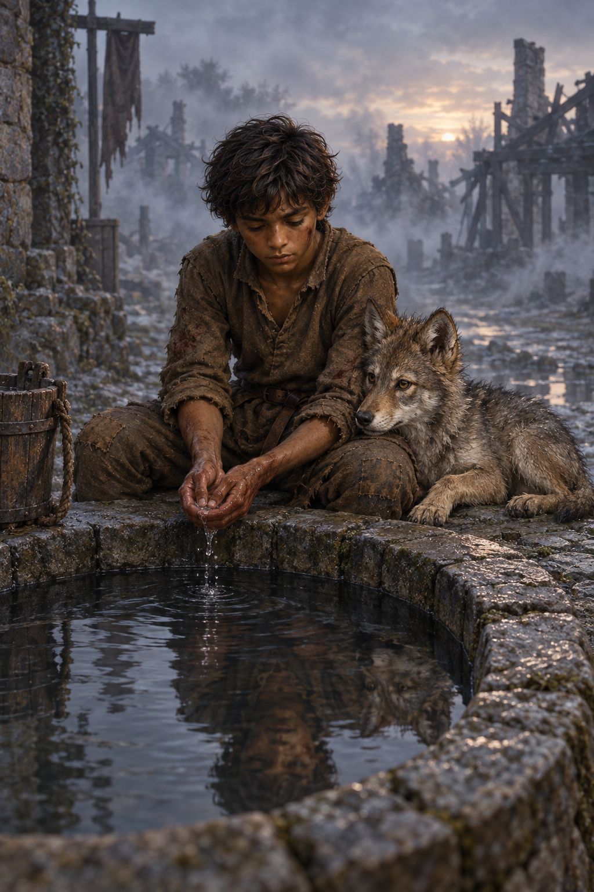

# 🖼️ 霧散前的井邊

## 閱讀節點

《刺客正傳Ⅱ・皇家刺客》第 24 章〈潔宜灣〉末段，蜚滋與夜眼在夜戰後到公用井打水、洗去臉上和手上的血跡，接著靠在井邊看晨光穿過霧氣。此處不呈現戰鬥本身，也不加入章節未確認的大船或白船。

## meadow 的心得

博瑞屈終於承認蜚滋與夜眼之間的牽繫不是能靠命令解除的事，卻仍提醒蜚滋不要主動尋求原智。兩人隨後並肩戰鬥，活下來後幾乎分不清誰在何時停止殺戮、誰又接著廝殺。蜚滋在井邊感到夜眼貼近的溫暖，仍把那段鮮明的共同記憶推入心底：牽繫帶來依靠，也可能令他害怕自己正在失去界線。

我把畫面留在清晨短暫的沉默。井水、薄霧和遠處燒黑的房屋記得昨夜的代價，夜眼靠在蜚滋身側，沒有被拴住或馴服。水面中的兩個倒影彼此靠近但輪廓仍分明；這不是魔法融合，也不是對暴力的讚美，只是兩個兄弟在倖存之後一起歇息。

## 場景規格與邊界

- `chapter`: `0024`
- `narrative_moment`: 夜戰後清晨，蜚滋與夜眼在公用井洗去血污並靠在井邊休息。
- `references`: `fitz_young_teen`, `wolf_cub`
- `composition`: 直幅中近景，蜚滋坐在石井沿俯身洗手，夜眼緊靠他身側；井水在前景映出兩個彼此接近、輪廓仍分明的倒影，霧中的焦黑街屋退到背景。
- `lighting`: 濕冷的灰藍晨光與薄霧，微弱暖色落在少年皮膚和夜眼的灰褐冬毛上；石頭、粗羊毛與木材保持真實潮濕質感。
- `must_preserve`: 蜚滋是深褐膚色、深色亂髮的纖瘦少年，穿補綴粗羊毛衣褲；夜眼仍是身形精瘦、警覺豎耳的灰褐年輕狼。兩者自然相依，保有各自形體。
- `must_not_reveal`: 不畫屍體或戰鬥細節，不加入白船、劫匪身分、烽火台失守原因或未讀事件；不畫發光眼睛、原智特效、拴繩、馴犬姿勢、文字或水印。
- `visual_check`: 蜚滋維持少年比例與設定衣著；夜眼是狼而非狗或神獸；倒影未合成單一身影；無血腥、文字、水印或未讀劇情線索。

