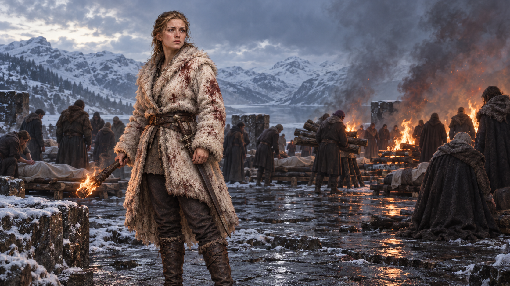

# 🖼️ 把復仇交還給名字

## 閱讀節點

第八章〈王后的覺醒〉裡，珂翠肯沒有讓死者繼續被當成追獵的燃料。她要求士兵卸下階級與裝飾，辨認每一具屍體、清洗遺容、準備火葬與宴席，讓無名者也得到名字與位置。血仍在衣服上，怒火也沒有消失；但她把這些情緒導向一場所有人都必須共同承擔的悼念。

這張圖選擇火葬前的片刻：珂翠肯站在冬日藍灰與葬火橘紅交界，手中的火不是勝利旗幟，而是替死者保留尊嚴的微小承諾。遠處的人群不再以武器和徽章區分彼此，而是低頭整理遺體、傳遞木柴、等待名字被說出。畫面不重演死亡，只留下領導如何讓人重新成為共同體的動作。

## meadow 的心得

珂翠肯的覺醒不是取得權力，而是把復仇的狂熱轉成有名字、有葬禮、有共同責任的悼念。她的真心與政治效果並不互相抵消；相反地，領導正是在不抹去傷痛的前提下，替眾人找回能一起行動的形狀。蜚滋則在毒與愛之間再次撞見自己的盲點：保護若不包含尊重與坦白，很容易變成另一種隔離。

## 場景規格與邊界

- `chapter`: `0008`
- `narrative_moment`: 珂翠肯把復仇獵殺改造成辨認死者、清洗遺容、火葬與共同悼念；畫面停在葬火將起、共同體重新聚攏的時刻。
- `references`: `ketricken`
- `composition`: 橫幅電影感中景；珂翠肯位於畫面中央偏左，手持低垂的葬火，身後是低調整理遺體與木柴的人群；不展示可辨識的死者面孔，不把人群畫成軍陣。
- `lighting`: 左側是冷的冬日藍灰雪光，右側是葬火的低矮橘紅；火光照出白毛皮上的血痕，也照亮她克制而疲憊的臉。
- `must_preserve`: 珂翠肯的白色血痕毛皮、深色長褲、騎馬靴、簡單長劍與樸素火把；濕冷黑石、積雪、粗木、煙霧與寫實奇幻書籍插畫質地。
- `must_not_reveal`: 不畫蜚滋、莫莉、切德、毒藥、狼、不明襲擊真相、後續王室事件、華麗王冠、可讀文字、徽章、魔法特效、血腥屍體特寫或水印。
- `visual_check`: 畫面主體只有珂翠肯與模糊的葬禮人群；火是悼念工具而非勝利象徵；無可讀文字、無水印、無後續劇透。

