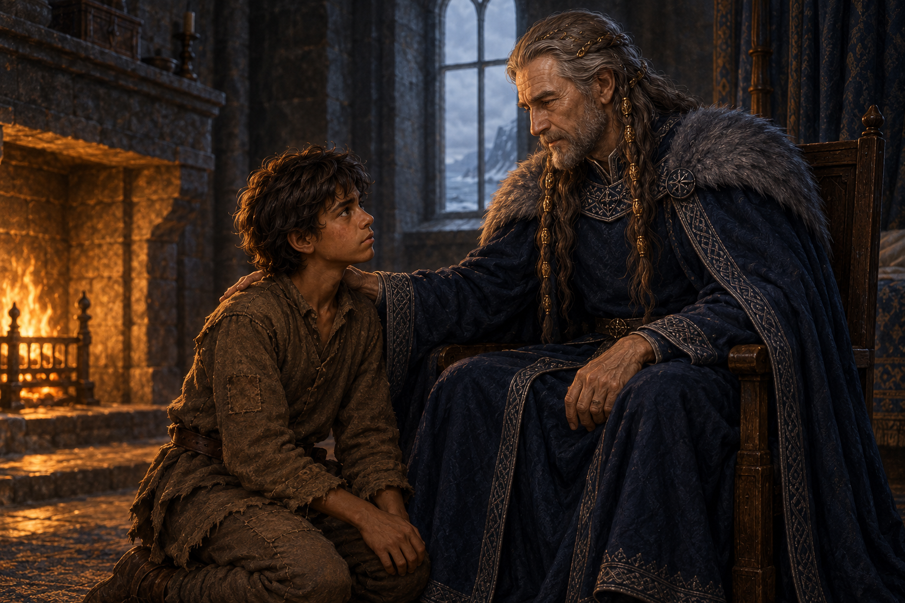

# 工具之外的骨肉

來源為《刺客正傳Ⅱ・皇家刺客》第29章〈俘虜〉。蜚滋跪到黠謀身前，國王把手放在他肩上，藉精技尋找惟真並告別。意識中的擁抱不畫成身體動作或可見光效；畫面停在國王仍活著、承認蜚滋是自己骨肉的片刻。

我不想讓這隻手替過去開脫。黠謀愛這個孩子，也讓他長年學會把自己理解成一件工具；蜚滋甚至還來不及辨認最後的問話是否又是一項考驗。親情與利用沒有互相消失。畫面保留少年肩上的重量與他抬頭等待的神情，讓遲來的承認仍值得渴望，也仍然令人疼痛。

沿用 [蜚滋](../NovelIllustrations/farseer-trilogy_01/Characters/fitz_young_teen.md)、[黠謀](../NovelIllustrations/farseer-trilogy_01/Characters/king_shrewd.md) 與 [臥房](../NovelIllustrations/farseer-trilogy_02/Props/king_shrewd_bedroom_fireplace.md) 的設定。國王比中性設定稿明顯消瘦、病弱；房間依本章已被搬走貴重物品，不複製早期設定稿的豐富陳設。

## 場景規格

- 章節與片刻：`0029`，黠謀坐著，蜚滋跪在身前，國王一手放在少年肩上；死亡尚未發生。
- 引用：`fitz_young_teen`、`king_shrewd`、`king_shrewd_bedroom_fireplace`。
- 構圖：橫幅近景，只框入兩人與部分石壁、暗淡床簾和木椅。原文在場的弄臣位於裁切範圍之外，並非被改寫成不在場。
- 光線：微弱爐光與冷灰窗光；局部暖色落在手、面孔、舊羊毛，無精技光效。
- 保留：少年的深褐膚色、凌亂深髮、補綴棕衣；國王灰鬍鬚、金線髮辮、深藍衣與毛領，明顯衰弱而仍清醒。
- 禁止：屍體、王冠、新武器主體、端寧或擇固、遠方惟真人影、逃亡結果、第30章資訊、可讀文字、水印。

## 視檢與生成記錄

已打開完成圖：兩名人物、蜚滋保持少年感與補綴棕衣，黠謀保留灰鬍鬚、金線髮辮與深藍毛領衣，手自然落在少年肩上；無可讀文字、光效或其他人物。表情克制，背景家具收斂。國王的消瘦較文字要求含蓄，畫面以手部與面容疲態承載病弱。第一版生成遭服務安全系統拒絕，未產生可用圖；以下為簡化場景後成功生成的實際 prompt。

## 最終生成 prompt

使用內建 imagegen 工具，實際 prompt：

Use case: illustration-story. A wide painterly medieval fantasy book illustration of a quiet farewell between a grandfather and his grandson. Reference image 1 establishes Fitz: a slender brown-skinned adolescent with tousled dark hair, patched brown wool clothing and worn leather belt. Reference image 2 establishes King Shrewd: an elderly gray-bearded man with long gray royal braids threaded with fine gold, navy wool robes, subtle silver embroidery and a worn fur collar. Show the king as frail and tired, sitting in a simple wooden chair, still alert and looking gently at his grandson. Fitz kneels before the chair and looks up; the grandfather rests one thin hand naturally on the boy's shoulder. Their expressions convey affection, regret and the weight of responsibilities left unsaid. Reference image 3 establishes the bedroom's dark stone and wood materials; simplify its furnishings to a spare room, with only a cropped plain bed curtain, faint warm firelight and cool gray window light. Tight two-person composition; the other attendant in the story is beyond the camera crop. Grounded wool, weathered wood and skin textures, restrained navy, brown and gray, realistic painterly brushwork. Keep the character identities from the references. No smile of triumph, no magical effects, no visible lettering or watermark. Scene reference: Royal Assassin chapter 29; setting ids fitz_young_teen, king_shrewd, king_shrewd_bedroom_fireplace. Illustrate only this quiet moment of physical touch, without depicting later events.

