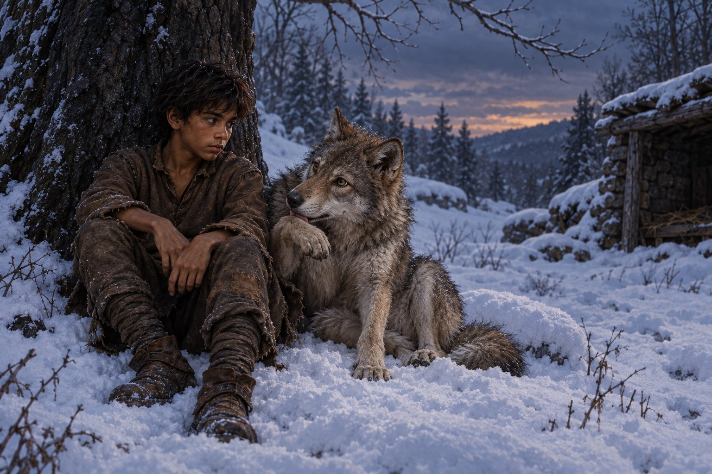

# 雪地裡重新承認的兄弟

## 閱讀節點

第十一章〈孤狼〉先讓蜚滋把「自由」做成一場殘酷的實驗。他把夜眼留在冬季牧羊人石屋附近，想用食物與距離替牠安排一段沒有自己的生活；夜眼卻指出那只是人類決定好的孤立。蜚滋因此用原智把牠推開，接著在回程遭三名被冶鍊者襲擊，直到夜眼回頭撞入戰鬥，替他重新撕開一條活路。

畫面選在戰鬥結束後的雪地停頓：蜚滋靠著黑色冬樹坐下，肩頸與前臂有克制的包紮和血痕；夜眼在他身旁舔拭受傷的前蹄，兩者都疲憊、警戒，卻不再互相拒絕。這不是馴服、寵物陪伴或英雄勝利，而是兩個仍保有各自感官與意志的生命，在共同受傷後重新承認彼此是兄弟。

## meadow 的心得

孤立不能假稱自由；真正的牽繫不是取消差異，而是承認彼此都能決定心之所向，仍在受傷時回到對方身邊。蜚滋以為把夜眼推遠就是保護，直到生死關頭才承認兄弟與狼群的關係，並學會讓信任成為雙向的選擇。這一章的雪不是把兩者隔開的空白，而是讓血跡、足跡與並肩的身影都變得清楚。

## 場景規格與邊界

- `chapter`: `0011`
- `narrative_moment`: 夜眼救出遭三名被冶鍊者圍攻的蜚滋後，兩者在雪地樹下整理傷口；蜚滋承認夜眼是兄弟，重新接受同個狼群的牽繫。
- `references`: `fitz_young_teen`, `wolf_cub`
- `composition`: 橫幅中遠景；蜚滋坐靠黑色冬樹、身體疲憊地微微前傾，夜眼位於他身旁舔拭受傷前蹄並抬眼看他；遠處只留下模糊雪地、樹影與被雪覆住的戰鬥痕跡，不展示屍體。
- `lighting`: 冷藍的傍晚雪光與即將降下的夜色，人物和狼身上有很弱的反光；不使用超自然光效，血色只作為少量敘事痕跡。
- `must_preserve`: 蜚滋是深褐皮膚、蓬亂深色短髮、瘦而結實的十四歲少年，穿補綴棕色羊毛與舊靴；夜眼是灰褐冬毛、仍在成長的幼狼，耳朵警覺、身形瘦小而有狩獵肌肉；兩者都顯出受傷後的疲憊，不畫成整潔擺拍。
- `must_not_reveal`: 不畫珂翠肯、惟真、弄臣或其他旁觀者，不畫可讀文字、徽章、狼群、後續命運、精技／原智可見特效、誇張血腥、斷肢或水印；不把夜眼畫成家犬、寵物或被馴服的動物。
- `visual_check`: 畫面只有蜚滋與夜眼兩個清楚主體；夜眼的名字與兄弟關係只由姿勢、視線與相互照料呈現，不依靠文字；無水印。

