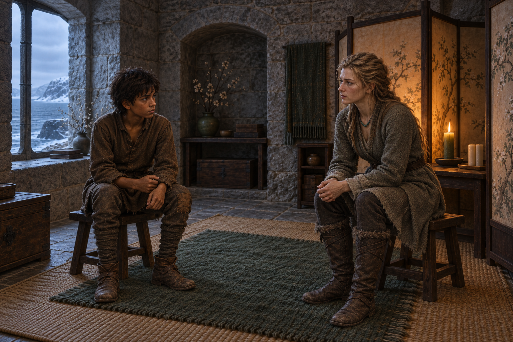

# 兩張矮凳之間的安靜

## 敘事焦點

蜚滋剛從莫莉的冷淡與弄臣的謎語中離開，帶著想把一切立刻解決的急躁來到珂翠肯的房間。珂翠肯已從前幾章的血與風雪中重新站穩；她不要求蜚滋回答，也不把原智變成表演，只邀請他在綠色月桂樹果蠟燭和羊皮紙屏風的暖光裡坐下。畫面要留下兩個人尚未真正理解彼此，卻暫時願意共享沉默的距離。

## 場景規格

- 章節：`0010`〈徒勞的奔波〉
- 必要人物：少年蜚滋、珂翠肯
- 參考設定：`fitz_young_teen`、`ketricken`、`ketricken_quiet_sitting_room`
- 構圖：橫幅室內中景；兩人分坐凹室裡相對的矮凳，珂翠肯在畫面一側較穩定，蜚滋身體微微前傾、手指不安地碰著袖口；羊皮紙花樹屏風與綠色蠟燭置於兩人之間，形成不阻斷視線的柔和邊界。
- 光線與氣氛：冬日石堡的冷藍灰從房間外緣退開，主要暖光來自屏風後的綠色蠟燭與遠處壁爐；安靜、克制、略帶不安，不要畫成浪漫約會或勝利場面。
- 必要資訊：簡樸房間、草席、綠色羊毛小地毯、兩張矮凳、花樹羊皮紙屏風、綠色月桂樹果蠟燭；珂翠肯穿簡單束腰上衣、綁腿與綠藍珠串，蜚滋穿沿用設定的磨損棕色羊毛衣褲。
- 不可洩漏：不畫原智的可見特效，不畫小狼、莫莉、弄臣或其他旁觀者，不加入第十章之後的事件，不把珂翠肯與蜚滋畫成已經和解或確立親密關係。

