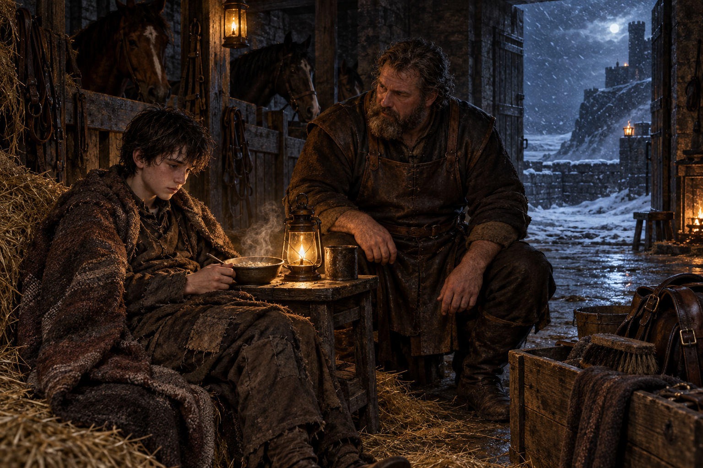

# 🖼️ 風雪後的馬廄歸鄉

## 閱讀節點

第二章〈歸鄉〉寫蜚滋在病後的風雪旅程中回到公鹿堡。他在城門前短暫借用了王室的姿態，卻被博瑞屈提醒：群山王國把他當成王子款待的經驗已經改變了他，而公鹿堡仍會把他看成駿騎的私生子。回到馬廄後，他虛弱到無法替煤灰卸下鞍轡，只能讓阿手接手，並在熱粥、麥酒與熟悉的馬廄氣味裡重新承認這裡是家。

## meadow 的心得

這幅圖把「家」放在照料的動作，而不是放在一個能抹平變化的房間裡。博瑞屈仍然是馬廄總管，皮革工作服、工具與穩定的姿態都沒有改變；蜚滋卻披著風雪後的破舊旅衣，坐在暖光邊緩慢恢復，讓別人暫時替他做他做不到的事。這不是被退回孩子的位置，而是允許一個已經變了的人在站不穩時仍被留下。

畫面也保留歸鄉的第二層陰影：馬廄入口外是冷藍色的雪夜，門內才有一小片黃燈與熱食。蜚滋必須從這片熟悉的暖處再走出去，去面對國王、王儲與帝尊所在的公鹿堡；所以暖光不是結局，而是他能帶著走向下一步的短暫支撐。

## 場景規格與邊界

- `chapter`: `0002`
- `narrative_moment`: 風雪長途後的公鹿堡馬廄／守衛室邊，蜚滋病後虛弱地坐在暖燈旁吃熱粥，博瑞屈在旁邊穩穩照料與看守；馬廄深處有安靜的馬匹輪廓。
- `references`: `fitz_young_teen`, `burrich`
- `composition`: 橫幅中景；蜚滋位於前景偏左，深色蓬髮、磨舊棕色旅衣、肩膀疲憊但已坐直；博瑞屈位於右側稍後方，穿深色皮革工作服，手邊有馬刷與盛食物的木盤；門外雪夜與馬廄木柵形成內外對照。
- `lighting`: 室內只有油燈與微弱爐火的暖黃光，落在蜚滋的手、熱粥與博瑞屈的肩膀；門外是冬夜的冷藍灰光；不以魔法特效表現原智或精技。
- `must_preserve`: 少年蜚滋的深色蓬髮、磨舊棕衣與病後虛弱感；博瑞屈的濃鬍、深色皮革工作服、厚實身形與可靠的照料姿態；寫實奇幻書籍插畫質地、潮濕黑石、木柵、羊毛與磨舊皮革。
- `must_not_reveal`: 不畫阿手的可辨識臉部或新人物設定、不畫帝尊、惟真、王后或後續宮廷事件；不畫戰鬥、毒藥、死亡、精技／原智光效、可讀文字、徽記或水印。
- `visual_check`: 生成後視檢人物數量、年齡感、服裝輪廓、馬廄內外光線、無後續劇透、無文字與無水印。

