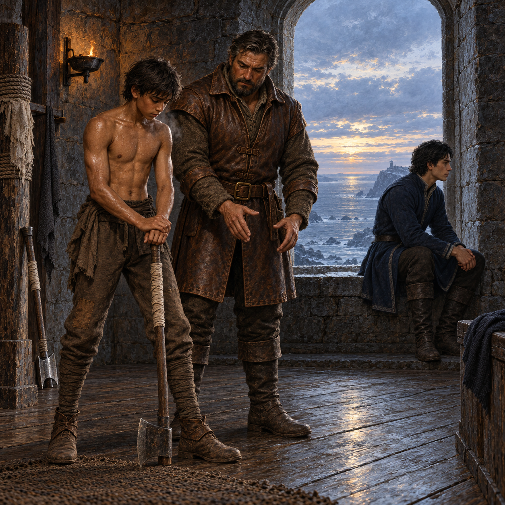

# 🖼️ 把自己的手交回斧頭

《刺客正傳Ⅱ・皇家刺客》第 15 章〈秘密〉把蜚滋推到兩種重量之間：弄臣把他說成能改變未來的線，惟真則把自己的恐懼與視野交到他身上。前者太巨大，幾乎讓蜚滋失去站立的能力；後者沒有替他解除命運，只讓他在烽火台的冷風裡看見同一條地平線。

這幅插圖選擇斧術訓練後的靜止瞬間。蜚滋手裡的斧頭安全地落在地面，博瑞屈以身體示範如何重新穩住姿勢，惟真坐在開窗邊望向海。斧頭不是英雄徽章，也不是預言的象徵；它是必須由蜚滋自己的手握住、由身體反覆練習才能成為力量的工具。三個人的距離保留了各自的責任，也讓「他就是我的武器」停在共同承擔，而不是被誰完全占有。

畫面不畫弄臣的掛毯、未來的災難或紅船的戰場。冷藍的海光、汗水與粗糙石牆只留下本章已確認的事：秘密可以被交出，視野可以被共享，但下一步仍要由一個人自己站穩。

