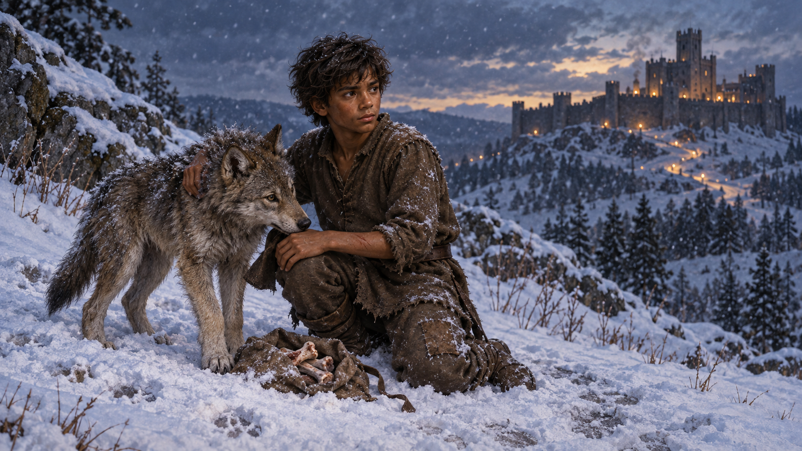

# 🖼️ 雪地裡的兩種家

## 閱讀節點

第九章〈防衛與牽繫〉把保護拆成幾種不同的形狀。耐辛放棄安靜的花園生活回到公鹿堡，因為她知道蜚滋需要教育與保護；蕾細則以針線活掩住刺客技藝，讓看似柔弱的日常也帶著防衛的鋒刃。珂翠肯在風雪中獨自去找惟真，拒絕被當成棋盤上只能等待的王妃；蜚滋追上她，卻只能在保護與尊重她的自主之間保持緊張的距離。

場景選在蜚滋與小狼雪地玩鬧後的停頓。骨頭袋破開躺在兩者之間，少年仍伸手靠近狼，身體卻朝向遠方公鹿堡的燈火。這不是把狼群畫成誘惑、把人類畫成正確答案；小狼的快樂與野性是真實的，而城堡裡的猜忌與責任也同樣真實。蜚滋只是知道自己可以走向另一種完整，仍決定回到必須承擔的位置。

## meadow 的心得

第9章讓我看見，牽繫不是把對方留在身邊，而是知道彼此各有本性與道路，仍願意承擔選擇之後的痛。耐辛放棄安靜生活回來保護蜚滋，珂翠肯在風雪中爭取作為妻子與王后的自主，小狼則用遊戲和野性邀請蜚滋離開人類世界；蜚滋最後回到城堡，不是否認狼群，而是承認自己同時被兩種家召喚，仍選擇對其中一種負責。保護若沒有說明與尊重會變成隔離，但完全不承擔牽繫，也只是把自由誤認成獨自離開。

## 場景規格與邊界

- `chapter`: `0009`
- `narrative_moment`: 蜚滋與小狼在雪地玩鬧、共享骨頭後停下；小狼邀他回歸狼群，蜚滋承認牽繫卻轉身走向公鹿堡的燈火。
- `references`: `fitz_young_teen`, `wolf_cub`
- `composition`: 橫幅黃昏遠景；蜚滋以少年身形跪坐在左中景，小狼貼近他身旁，破裂的骨頭袋位於兩者之間；遠方城堡燈火提供一條視線方向，但不把兩者畫成對立陣營。
- `lighting`: 冷藍雪光與暮色覆蓋前景，公鹿堡以稀疏的琥珀燈光落在遠方山脊；雪花與呼吸白霧保持寒意，無超自然光效。
- `must_preserve`: 蜚滋是深褐皮膚、蓬亂深色短髮、瘦而結實的十四歲少年，穿補綴棕色羊毛與舊靴；小狼是灰褐冬毛、警覺而有玩心的幼狼，不畫成家犬。
- `must_not_reveal`: 不畫珂翠肯、耐辛、蕾細、博瑞屈、母老虎、武器、狼的名字或後續命運；不畫精技／原智特效、可讀文字、徽章、浪漫化人獸關係、血腥特寫或水印。
- `visual_check`: 畫面只有蜚滋與小狼兩個清楚主體；骨頭袋、雪地玩鬧後的疲憊、城堡遠燈與少年朝向人類世界的選擇均可辨識，無文字與水印。

