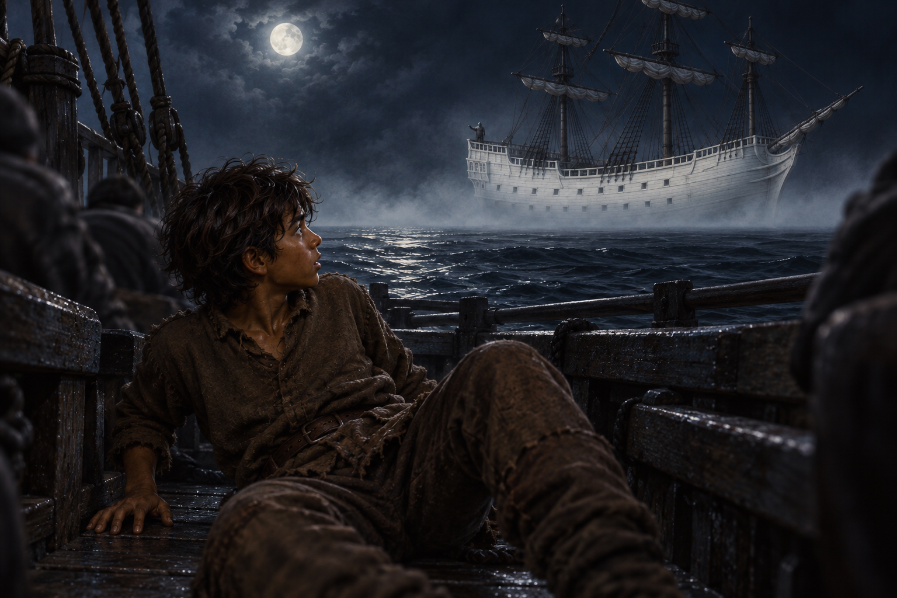

# 🖼️ 黑海裡唯一看見的白船

《刺客正傳Ⅱ・皇家刺客》第 16 章〈惟真的艦隊〉讓蜚滋先學會在霧中傳出一則警告，再讓他在海戰裡被整群人的憤怒吞沒。當白船出現，熟悉的精技與原智牽繫卻同時中斷；他看見一艘遠大於紅船的白色巨船，以及一個朝自己指來的灰甲人影，卻沒有任何人能替這段目擊作證。

我把畫面停在蜚滋跌回狹窄划槳甲板的瞬間。蜚滋仍是前景裡真實、疲憊的少年，白船則隔著大片無回聲的黑海；周圍的船員只留模糊輪廓。灰甲人影沒有可辨認的面容，白船也沒有魔法光效。這份距離不是答案，只是蜚滋當下無法跨過的空白。

這幅圖不把白船判成幻覺，也不把它升格為已知的超自然真相。它保留一個人確實如此看見、卻暫時無法與任何人共享的經驗；即使關係和感官回聲突然抵達不了，蜚滋仍得用自己的眼睛和身體面對那片海。

