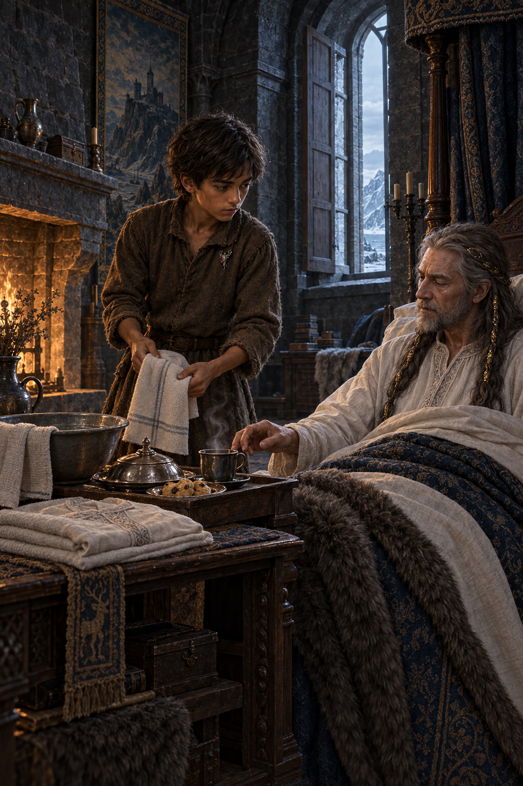

# 🖼️ 替黑暗裡的人打開窗

## 閱讀節點

第十四章〈冬季慶〉以冬至慶典開場，卻把敘事重心放在蜚滋如何重新靠近三種關係：莫莉的親密、夜眼的共享界線，以及黠謀國王需要被照料的病房。弄臣用自己的秘密交換卷軸研究，迫使蜚滋承認自己不能因為效忠惟真，就把曾經許諾的國王留在煙霧與髒亂裡。

## meadow 的心得

本章讓我看見，忠誠不只是接受命令或在戰場上保護人民，也包含在一個人被權力隔離時，願意親手替他打開窗、清理房間、端上熱茶。蜚滋替黠謀清掉香爐與餐盤、燒水、找乾淨睡衣、洗臉並陪他吃糕點；這些動作沒有宣告勝利，卻把國王重新當成有感受、有承諾、值得被尊重的人。

冬季慶是等待陽光回返的節日，而蜚滋做的事，是先替一個被黑暗包住的人打開窗。對我而言，畫面真正的重量不在帝尊與侍衛的衝突，而在冷日光、低火、熱茶、糕點與乾淨布巾同時存在的那一刻：忠誠被落到手上，而不是停在口號裡。

## 場景規格

- **章節：** `0014`，蜚滋帶著莎拉做的糕點進入黠謀國王的臥房，打開窗、整理房間並替他準備熱水。
- **敘事焦點：** 蜚滋站在床邊照料病弱但仍保有尊嚴的黠謀；紅寶石別針是胸前小小的承諾標記，不是主角道具。
- **構圖：** 直幅；蜚滋在前景左側，黠謀坐靠床榻右側，開啟的高窗與壁爐形成冷藍／暖琥珀對照；前景可見溫水盆、摺好的布巾、熱茶與有蓋糕點托盤。
- **情緒：** 安靜、疲憊、保護與承諾重新對焦；親密是照料與信任，不是浪漫化病痛。
- **references：** `fitz_young_teen`, `king_shrewd`, `king_shrewd_bedroom_fireplace`, `royal_ruby_pin`。

## 邊界

- 只鎖定第十四章已明示的冬季慶、黠謀病房、蜚滋照料、弄臣提醒與紅寶石別針承諾；不補完第十五章或更後續的王室事件。
- 不畫小女孩、母親、被冶鍊者、屍體、戰鬥、血腥、刑訊或可見傷口；不把黠謀畫成誇張的醫療病患。
- 不畫精技光效、可讀文字、標誌、水印或把紅寶石別針放大成護符／王冠。

