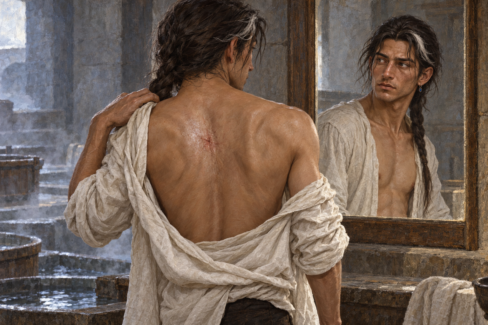

# 🖼️ 鏡中，傷痕仍在

來源為《刺客正傳Ⅲ・刺客任務》第二十二章〈啟程〉，[meadow 第一輪心得](../../BookNotes/Library/media/book-farseer-trilogy_03/readers/meadow/chapters/0022/r1_2026-10-06.md)。在精技夢境之後，蜚滋到頡昂佩澡堂洗浴、刮鬍，並在鏡中看見王室折磨留下的面部疤痕和仍然歪斜的鼻子；他再轉身越過肩膀檢視背上才拔箭的傷口。這些痕跡沒有隨那次非凡的觸碰消失。

我把畫面停在他看向鏡子的時刻。鏡面沒有把他變回舊日模樣，也沒有把惟真的力量畫成光；改變發生在蜚滋理解別人的方式裡。他仍不贊成切德與珂翠肯將女兒作為王位繼承人和公國象徵的安排，卻不再只用怒意看待他們。他能看見他們相信自己在做正當的事，並沒有因此把自己的反對撤回。

蜚滋身體上的傷仍需時間，對莫莉與女兒的願望也沒有答案。鏡中的平靜不是痊癒或和解，只是一個人帶著原有的傷，開始看見更大的處境；他仍選擇尋找惟真，下一段旅程尚未開始。

## 場景規格與引用

- [fitz_jhaampe_after_arrow](../NovelIllustrations/farseer-trilogy_03/Characters/fitz_jhaampe_after_arrow.md) v1 已先行生成與視檢；保留偏瘦年輕成人、額前白髮與戰士髮辮、剃淨的鬍鬚、歪鼻、面部淡疤、白色寬袖羊毛襯衫、黑色短外套與單枚藍寶石耳環。
- 場景引用設定稿的蜚滋身份與外貌。從背後取腰上構圖，他隔肩看向澡堂冷端的普通鏡子，鏡中可見面容；背部只呈現閉合、仍在癒合的中央傷痕，不畫開放傷口或血。腰下由裁切與布料遮住，非情色構圖。
- 牆面鏡子、浴池邊緣、礦物蒸氣、冷冬日光與灰石／舊木材質是場景詮釋；鏡子不具特殊力量。沒有惟真、精技河流、廢墟城市或其他人物入畫。

## 生成提示詞與版本

內建 imagegen；開畫前已用 `view_image` 打開 `fitz_jhaampe_after_arrow_v1.png`，並在 prompt 中重述外貌。完整 prompt：

Use case: illustration-story. Create a finished horizontal realistic painterly book illustration for Assassin's Quest / Farseer Trilogy volume 3, chapter 22 'Departure'. Reference fitz_jhaampe_after_arrow v1, opened and inspected. The attached image is a CHARACTER IDENTITY AND CURRENT-APPEARANCE REFERENCE: keep this young adult Fitz with deep brown skin, lean build, crooked healed nose, subtle pale torture scars on his face, freshly shaved jaw, a narrow white forelock tied into his dark warrior's braid behind the shoulder, simple white loose-sleeved wool shirt and one small sapphire earring. Depict the exact quiet moment in the cool end of a mountain bathhouse after he has washed and shaved: he stands with his back partly turned toward a simple wall mirror and looks back over his shoulder at his reflection, inspecting the healing arrow wound in the center of his back. Frame him from waist up from behind, with his reflected face visible in the mirror; the wound is only a closed healing red star-shaped mark with taut shiny surrounding skin, no blood or open tissue. His reflected eyes are thoughtful and newly calm, not happy or triumphant; his face and scars are unchanged. A little mineral steam and a faint blurred hint of bathhouse basins may sit low in background, but keep the room spare and subdued. Natural cool winter daylight, quiet gray stone and warm muted wood, soft light grazing his shoulder and mirror. The composition should suggest an inward change while the body's visible history remains; do not make the mirror supernatural or split the face into different emotions. Realistic literary fantasy book illustration with visible oil-and-gouache brushwork and paper grain, not a photo, not glossy concept art. Respectful nonsexual framing, chest/torso fully within the mirror's natural crop; no nudity below the waist. No other people, no Verity, no Fool, no wolf, no Skill river, no ruined city, no magical glow, no new wound, no text, lettering, frame, title or watermark. No events beyond chapter 22.

## 視檢與驗收

v1 已打開檢查：鏡前只有一名蜚滋，背面與鏡中面容構成同一個人；白髮髮束、戰士髮辮、歪鼻、細淡面疤、乾淨下巴與單枚耳環沿用設定。背部正中有閉合的紅色癒合痕，不見血或開放組織；浴池與蒸氣留在背景。畫面沒有魔法光、其他角色、文字或水印，沒有把他身體上的傷畫成已消失。

畫廊索引以 `build_gallery.py` 重建並以 `--check` 驗收。

