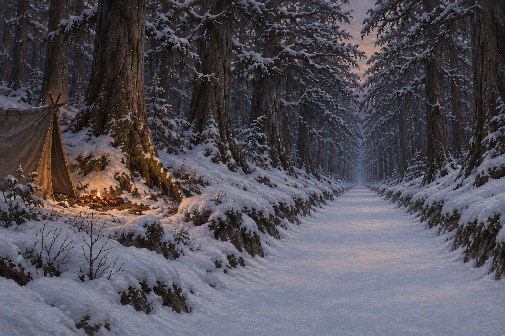

# 🖼️ 路把我叫走

來源為《刺客正傳Ⅲ・刺客任務》第二十四章〈精技之路〉，[meadow 第一輪心得](../../BookNotes/Library/media/book-farseer-trilogy_03/readers/meadow/chapters/0024/r1_2026-10-06.md)。蜚滋發現自己被一條寬闊、筆直、沒有足跡的雪路吸引。他的注意力和時間感開始散掉，夜眼察覺他變得不對勁，弄臣與水壺嬸也設法把他帶離路面。水壺嬸提及由精技淬鍊之物的古老傳說，但道路是否因此形成仍未被確證。

我把畫面留在夜色裡的林緣營地：一小簇火和帳篷停在左側，平整的路面伸向黑暗森林深處。路看起來容易走，卻沒有足跡、獵物或任何可追隨的標記。蜚滋說出自己的恍惚，讓同伴能察覺並替他守住退路；那點火光因此不只是照明，也代表他尚能回到身邊的人與狼那裡。

古道的低平雪面、筆直路形、沒有足跡與根系侵入依設定卡；帳篷位置、火光與林緣視角是場景詮釋。畫面不出現人物、動物、魔法光效或路牌，也不把精技傳說寫成道路已確認的起源。夜裡的夢境沒有被畫成蜚滋肉身旅行或他和莫莉真正團聚；他看見她們之後仍回到自己的身體，在朋友臂彎與夜眼的同情中入睡。

## 場景規格與引用

- [untracked_mountain_road](../NovelIllustrations/farseer-trilogy_03/Props/untracked_mountain_road.md) v1 已先行生成與視檢。沿用寬直、略低於林地、覆著平整雪面的古道，以及向道路兩旁拱起的古樹；不補道路年代、目的地或建造方式。
- 場景取章中營地被移至道路旁之後的夜晚。帳篷與微火在左側林緣，無足跡的道路占右側主要構圖並消失在深林中。人物、傑帕與夜眼全在畫外，不新增角色設定。
- 冷灰藍雪色、暗林與有限的琥珀火光表現誘惑與可退回的安全感。精技拉力只藉由筆直的透視和視線方向暗示，沒有具象化為光線或能量。

## 生成提示詞與版本

內建 imagegen；開畫前已打開並視檢 `untracked_mountain_road_v1.png`，並在 prompt 中重述道路的寬直形狀、低於林地的雪面、古樹拱頂與無足跡狀態。完整 prompt：

> Use case: illustration-story. Create a finished landscape literary fantasy book illustration for Assassin's Quest / Farseer Trilogy volume 3, chapter 24 'The Skill Road'. Reference: untracked_mountain_road_v1, already opened and visually inspected. This is a LOCATION APPEARANCE reference: preserve the broad straight shallow road through very old trees, its pristine smooth snow, the slightly sunken surface, branches arched overhead, and the complete absence of tracks or roots crossing it. Depict one exact moment at dusk after the travelers move their camp away from the road's center: frame an empty pale road dominating the right two-thirds, disappearing beneath dark interlaced branches; on the far left at the forest edge, a small dim ember fire and the side of a simple leather travel tent sit safely off the road. Leave all people, animals, and cargo outside the image. Keep the road's snow undisturbed and trackless. The surrounding forest floor is rougher and deeper with snow, emphasizing the contrast between the orderly straight path and the wild forest edge. Create a restrained visual tension through perspective and cool shadow, as if the road quietly draws the eye, while the modest amber campfire offers a fragile point of human warmth. Do not show any literal magic, luminous strands, glow, portal, ghost, dream image, footprints, animal tracks, labels, or identifiable destination. Realistic painterly literary fantasy book illustration with visible oil-and-gouache brushwork, paper grain, muted charcoal, blue-gray snow, and sparse firelight; not glossy concept art. No figures, no text, lettering, title, frame, or watermark. No events beyond chapter 24.

## 視檢與驗收

v1 已打開檢查：畫面只有林緣帳篷、微弱火光和伸入森林的無足跡雪路。道路外觀沿用設定稿，沒有腳印、人物、動物、文字、路標、水印或可見魔法光效；火光與道路的冷暗對照是構圖詮釋，並未證明道路的精技來源。

畫廊索引以 `build_gallery.py` 重建並以 `--check` 驗收。

