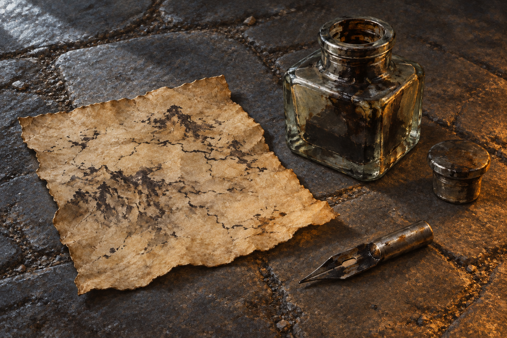

# 🖼️ 潦草的圖，也能帶人回去

來源為《刺客正傳Ⅲ・刺客任務》（`book-farseer-trilogy_03`）第二十七章〈城市〉，meadow 第一輪閱讀心得。蜚滋在古城高塔找到羊皮碎片、硬墨與失去木柄的金屬筆尖，臨摹白石嵌板上的地形，等墨乾後收進襯衫。完整心得住在閱讀庫 [第二十七章 r1](../../BookNotes/Library/media/book-farseer-trilogy_03/readers/meadow/chapters/0027/r1_2026-10-07.md)。

我留住的是他知道圖不漂亮，仍知道它會有用的停頓。古城裡的歌聲、居民與火光讓一個完整世界近在眼前，卻不能替他供應一頓飯、一夜暖意或回去的路。那片硬黃紙只有粗拙墨痕，反而可以被保護、攜帶、交給同伴比較。等墨乾的耐心，使希望具有一個他此刻能照料的形狀。

參考設定 [古城高塔的臨摹用具](../NovelIllustrations/farseer-trilogy_03/Props/tower_copying_kit.md)。畫面只見羊皮碎片、無柄金屬筆尖與硬墨瓶，灰冷日光與將熄的火光落在磨舊石地上。黏土地圖模型與白石嵌板留在畫外，避免把三種地圖混成一物；人物、龍與幽影也不出場。這份小小的所得沒有證明惟真已被找到，更沒有解除精技渴求。

## 場景規格與完整提示詞

Chapter 27, Assassin's Quest. Narrative moment: immediately after Fitz has finished a rough terrain copy in the ruined city tower, before he puts it inside his shirt. References: tower_copying_kit (input image 1 is a prop identity and painterly style reference, not an edit target). Create a new standalone landscape literary fantasy book illustration: close overhead three-quarter still life on a worn dark stone floor, one small stiff irregular yellowed parchment scrap showing sparse rough unreadable terrain strokes, one short all-metal writing nib without any wooden handle, and the same heavy square-shouldered gray-green glass ink bottle with dried dark ink and separate simple stopper. Preserve the reference's parchment texture, nib silhouette, thick translucent bottle and restrained oil-gouache treatment. Cold dim late-afternoon winter light enters from off-frame; faint low amber firelight falls across one edge, from an almost spent fire outside the frame. Quiet imperfect usefulness rather than triumph. Floor layout, object placement and light are visual interpretation. Only the three referenced objects plus the bottle stopper; no people, hands, animals, ghosts, dragon, clay city model, wall map panel, candle, quill, readable words, compass rose, identifiable geography, labels, magical glow, title, border, or watermark. The ink drawing must remain an imperfect fragment, not a finished authoritative map.

## 視檢

v1 已打開視檢：一塊硬黃羊皮碎片、一枚無木柄全金屬筆尖、一只厚玻璃墨瓶與独立塞子，與設定稿外型一致；冷灰石地與右側低暖光符合構圖。墨痕不可讀，沒有人物、龍、幽影、城市模型、嵌板、文字、羅盤或水印。物件安放與光線為詮釋，沒有增補目的地或安全結果。

