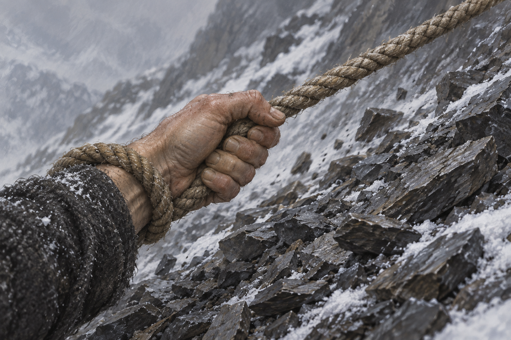

# 🖼️ 分擔一部分重量

來源為《刺客正傳Ⅲ・刺客任務》（`book-farseer-trilogy_03`）第二十八章〈精技小組〉。蜚滋抱著發燒的弄臣困在滑動岩屑中，珂翠肯帶傑帕與繩索回來，繩的阻力使他得以維持步伐。完整心得：[第二十八章 r1](../../BookNotes/Library/media/book-farseer-trilogy_03/readers/meadow/chapters/0028/r1_2026-10-07.md)。

我想保存的不是救援使他突然有力氣，而是重量被分擔。他背傷痛、手臂顫抖，腳下仍在移動；一條繩索讓他獲得恰好足夠的阻力，另一端有同伴與動物的行動。畫面的手沒有獨力攀上高峰，繩也沒有替他取消危險。能夠繼續走，是多人多物共同完成的事。

參考設定 [山崩中的救援繩索](../NovelIllustrations/farseer-trilogy_03/Props/landslide_rescue_rope.md)。只畫裁切成人右手、手腕繞一圈的繩與移動碎頁岩，人物臉、另一隻手、弄臣和傑帕都在畫外；袖口、纖維材質與岩石排列為視覺詮釋，局部不補定人物外觀。同章稍後的伏擊和水壺嬸自述由心得承接，這張圖不替那些行動宣告正當或赦免。

## 場景規格與完整提示詞

Use case: illustration-story. Chapter 28, Assassin's Quest. References: landslide_rescue_rope; input image 1 is rope material and painterly style reference, not an edit target. New standalone landscape literary fantasy book illustration. Extreme close-up of exactly one adult right hand and wrist cropped at the lower-left edge, grasping a taut traditional twisted gray-brown natural-fiber rope, with one simple turn of that same rope around the wrist, continuing diagonally toward the upper-right and out of frame under visible tension. Preserve the reference rope's coarse twisted strands, muted hemp color and worn fibers. Correct right-hand anatomy, five digits total, thumb opposing curled fingers around the rope, no extra hands or fingers. Sleeve is plain worn charcoal wool, interpretive and anonymous, no identifiable character design. Beneath it a steep field of loose angular dark shale, a few stones sliding downhill, thin patches of cold snow between stones. Cold overcast winter light, strained quiet movement, oil-and-gouache realistic book illustration, gray-black-white restrained palette. This is the moment of shared support during a rescue, not a triumphant summit. No faces, bodies, other people, animals, blood, harness, modern climbing equipment, bow, arrows, battle, ghosts, magic, letters, diagram labels, border or watermark. Rope endpoints and supporting companions stay beyond frame. Do not add knots or instructional steps.

## 視檢

v1 已打開核對：只有一隻成人右手與裁切袖口，拇指對向四根屈曲手指，繩索在腕側繞過一圈並向右上拉緊；粗捻灰褐纖維延續設定。雪與碎頁岩形成陡坡，無人物臉、其他手、動物、血、文字或水印。局部動作不補定可辨識人物外貌；岩屑排列與袖口屬詮釋。

