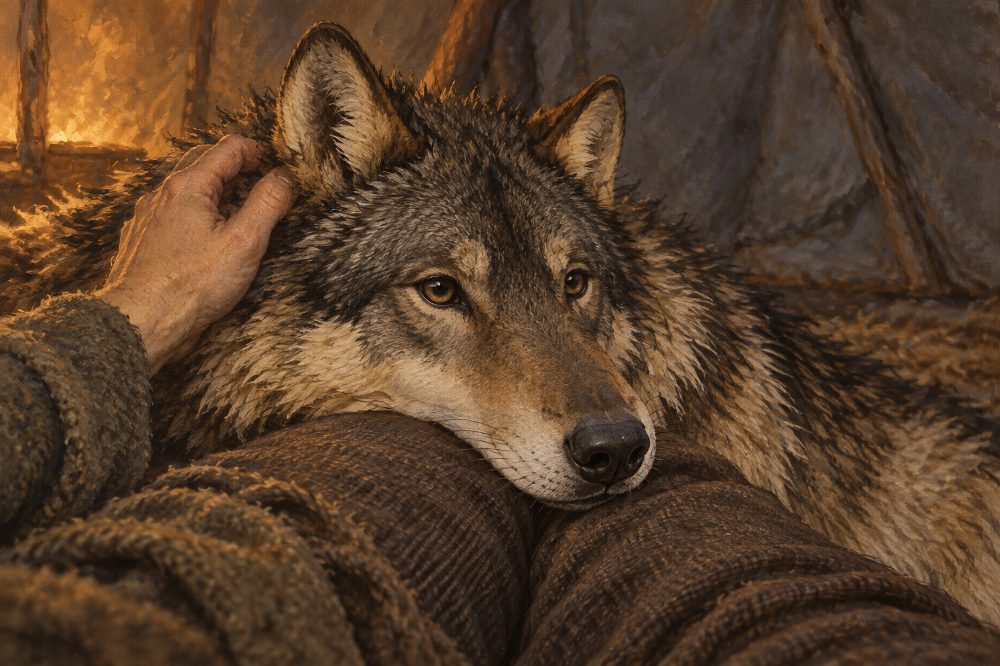

# 🖼️ 還懂得這個碰觸

來源為《刺客正傳Ⅲ・刺客任務》第二十六章〈路標〉，[meadow 第一輪心得](../../BookNotes/Library/media/book-farseer-trilogy_03/readers/meadow/chapters/0026/r1_2026-10-06.md)。蜚滋被古道殘留的景象誘向已毀岔路，夜眼將他拖回。回到帳篷時，他卻聽不見狼兒的心聲，連人的言語也變成難以理解的聲音。弄臣交給他的熱茶、夜眼靠在腿上的頭，仍是他能理解的動作。

我將畫面留在這個很小的通道裡：夜眼睜著自然深色的眼睛，長吻貼在羊毛衣料上，一隻手搔著耳後。牠没有微笑，也沒有睡去；靠近既是信任，也是請求。蜚滋在此刻還不能完整回應牠，這份碰觸卻讓彼此不至於只剩陌生的聲音。

暖光、粗布的色澤與帳篷配置是視覺詮釋，不冒充章內精確形制。蜚滋的臉與夜眼舊左肩傷部位在畫外，不新增人物外貌或復原結果。路邊救援、幻象旅人、水壺嬸的棋局與章末黑石圓柱不合成入畫；這不是整章危險已解除的圖。

## 場景規格與引用

- 引用 [成年夜眼](../NovelIllustrations/farseer-trilogy_03/Characters/nighteyes_adult.md) 的 v1 設定稿，開畫前已打開視檢；保留成熟長吻、灰褐毛、黑色護毛、淡奶黃耳頸與自然深色眼鼻。
- 可辨識主體只有夜眼；蜚滋只以一隻手與裁切的腿部衣料出現，依工作流的刻意留白例外，不新增完整人物設定。
- 畫幅採頭頸近景，肩部傷口無法辨識；沒有精技或原智光效，也沒有把牠變成幼犬或寵物裝扮。

## 完整生成提示詞

內建 imagegen，引用設定圖作外貌參考，並非改寫設定稿。使用以下 prompt：

> Create one finished literary fantasy book illustration, use case illustration-story, based only on Assassin's Quest / Farseer Trilogy volume 3 chapter 26 'Waymarkers'. Reference role: attached adult Nighteyes wolf character plate, not an edit target. Preserve its mature gray-brown wolf head, dark guard hairs, pale cream-yellow ear and neck fur, deep natural brown eyes, long dark muzzle and black nose; no collar. Narrative moment: inside a winter traveling tent, after the young man has become unable to hear his wolf companion's mind. The wolf lies beside him and rests its large head across one thigh; he gently scratches behind the wolf's ear, understanding the tangible gesture while words have become strange. Tight intimate close composition: only ONE wolf head and upper neck resting sideways on a cropped wool-clothed human thigh, and ONE anatomically natural bare hand scratching behind one ear. Human head, shoulders and identity out of frame. The wolf's expression is quiet, attentive and worried, eyes softly open, leaning into contact; not a smiling pet dog, not asleep or magically healed. Crop before the wolf shoulders so prior shoulder injury recovery is not asserted. The rest of the body is outside frame. Subdued amber brazier light from outside the picture, cold gray canvas shadows, visible coarse cloth and fur texture, oil-and-gouache on grainy paper, restrained earthy muted literary fantasy palette, no glossy photography. No cup, jewelry, additional people, extra hands, paw, weapons, map, game board, black pillar, hallucinated travelers, future events, magical light, glowing eyes, spirit forms, captions, lettering, border or watermark. Landscape format. Convey incomplete connection and care rather than triumphant reunion.

## 視檢與版本

v1 已打開檢查：一匹成年狼的頭頸與一隻搔耳後的手，狼頭依靠粗羊毛衣料；自然深色眼鼻、淡黃耳頸與黑色護毛可辨。人物臉、狼肩傷部位不可辨識；沒有額外人物、項圈、文字、水印或魔法光。左後方有少量火光，屬營地照明詮釋；不視為章內指定火盆形制。圖中靠近不代表原智已恢復。

