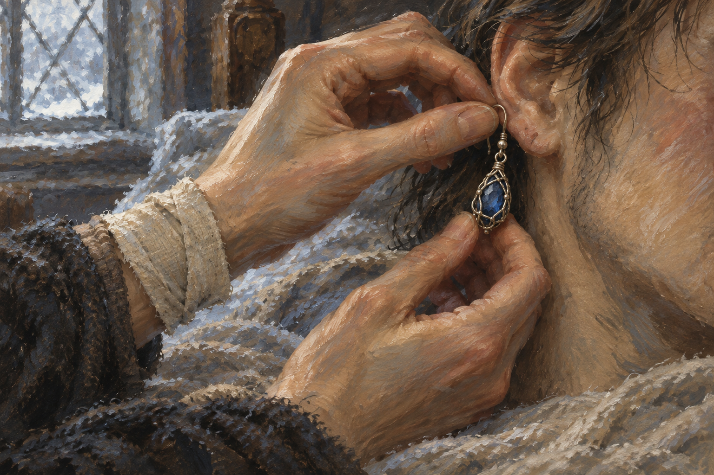

# 🖼️ 耳環作證

來源為《刺客正傳Ⅲ・刺客任務》第二十一章〈對抗〉，[meadow 第一輪心得](../../BookNotes/Library/media/book-farseer-trilogy_03/readers/meadow/chapters/0021/r1_2026-10-06.md)。椋音終於進到蜚滋床邊，從腰帶的小囊取出他以為遺失的耳環，親手替他戴回去。她也坦白已把蜚滋仍活著、惟真未死，以及莫莉和女兒需要知道的事告訴珂翠肯；耳環正是她用來證明自己所言非虛的信物。

我把畫面停在耳鉤就要扣好的剎那。這不是和解的姿勢：蜚滋剛得知自己的秘密被說出，仍以為所有事情都完了；椋音則相信莫莉有權知道丈夫尚在人世。耳環讓兩種意志短暫地碰在一起，既帶著越界的刺，也帶著一個人不肯讓另一個人被孤立在謊言裡的照料。

這枚藍寶石不能替任何人決定孩子將有什麼人生，也不能保證莫莉會等到蜚滋回去。它只證明一件更小、卻迫切的事：有人已經把他的消息帶到遠方。畫面只露匿名的手與床上人的耳側，不呈現面容或傷口，讓焦點留在信物重新回到身邊、而信任仍需修補的瞬間。

## 場景規格與引用

- [freedman_sapphire_earring](../NovelIllustrations/farseer-trilogy_03/Props/freedman_sapphire_earring.md) v1 已先行視檢；沿用單一小型深藍寶石、細舊銀絲網、小連接環與可穿耳小鉤。設定稿的金屬暖灰反光保留為舊銀質感，不加黃金部件。
- 章中椋音以雙手協助蜚滋戴回耳環；她的一隻手有繃帶。畫面以裁切的雙手、少量包紮腕部、耳朵與鬢髮呈現，不露可辨識面容，也不把傷口或箭傷畫入。
- 床邊的冷冬日光與室內昏暖反光是場景詮釋；不加入其他人物、治療過程或後續結果。耳環本身不發光，不增家徽、文字或魔法。

## 生成提示詞與版本

內建 imagegen：先生成場景，再依工作流視檢並作風格修正。場景初稿以已開啟的 `freedman_sapphire_earring_v1.png` 作道具身份參考；最終版本以初稿作構圖編修對象，並以耳環設定稿再次鎖定道具外觀。最終修正 prompt：

Transform the FIRST attached image into a clearly hand-painted realistic literary fantasy book illustration, using visible oil-and-gouache brushwork, softly broken edges, subtle paper grain, and restrained painterly texture. It currently looks too much like a photograph. Preserve the exact composition and action: two gently weathered hands fastening the single dangling earring to a cropped anonymous ear, the simple bandage on the upper wrist, partial dark hair and cheek, cool winter window light at left, dim bedside atmosphere. Preserve exactly one small deep-blue sapphire enclosed in fine aged SILVER wire lattice with a small hook; use the SECOND attachment only as the earring's identity reference. Keep natural anatomy, believable intimate scale, muted gray-brown palette with restrained blue, no new details. The result should look like an illustration painted for a literary fantasy novel, not photography, not glossy digital concept art, not an advertising image. Keep the scene tender but unresolved. No face, no added people, no extra jewelry, no wounds, no text or watermark.

## 視檢與驗收

v1 已視檢：油彩與水粉筆觸、紙面顆粒和柔化邊緣清楚可見；耳環仍為單一藍寶石舊銀絲網與小鉤。雙手正在替床上人物戴回耳環，一隻手腕有簡單繃帶，畫面沒有可辨識面容、傷口、其他人物、文字或水印。冷窗光與床邊昏暖反光保持克制，沒有把越界替人做決定畫成和解完成。

畫廊索引以 `build_gallery.py` 重建並以 `--check` 驗收。

