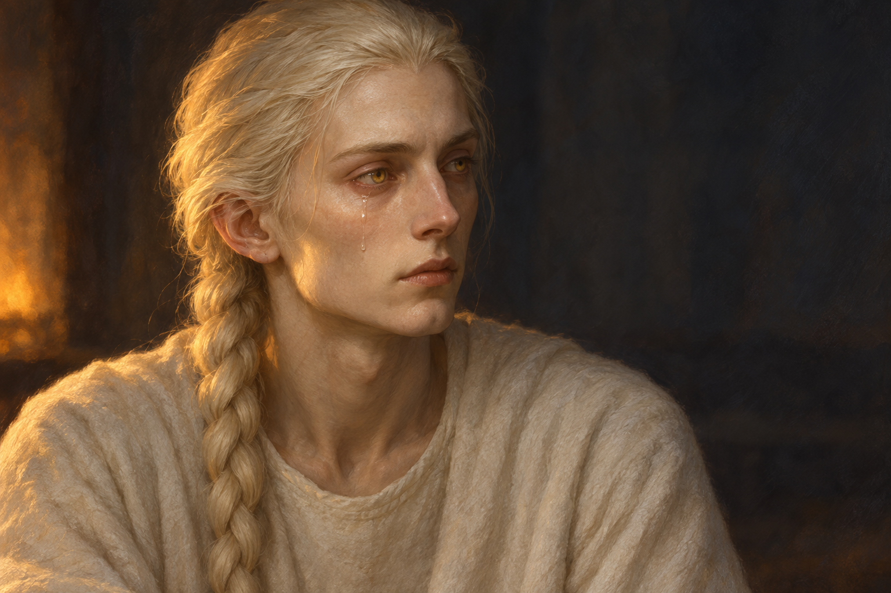

# 🖼️ 在那些名字之前

《刺客正傳Ⅲ・刺客任務》第二十章〈頡昂佩〉，蜚滋終於認出照顧他的弄臣。對方坐在床邊，沉默地望向黑暗，一滴淚沿窄鼻旁的臉頰流下。我選這個落淚的停頓，而不是把兩人畫成拯救世界的英雄。

弄臣先前把蜚滋的死訊理解成使命與自我的崩毀，重逢又讓命運恢復重量。到章末，他容許兩人此刻只作自己，明天再面對那些稱號。我想留住的是一個人仍在呼吸，足以讓另一個人重新呼吸；但這份依戀也不能替蜚滋取消休息的需要，不能保證使命的說法全是真的。

畫面選章中床邊靜坐落淚的具體時點，章末的話是閱讀理解，不合成額頭相靠、舉杯、拔箭或雪地救援。蜚滋在畫外，背部箭傷與凍伤沒有因此消失。

## 場景規格與引用

- references：[頡昂佩的弄臣](../NovelIllustrations/farseer-trilogy_03/Characters/fool_jhaampe.md)，已先繪設定稿並視檢。
- 一人頭肩近景，坐在蜚滋床邊，沉默越過畫外傷者望向黑暗；單滴自然淚水沿鼻旁臉頰流下。
- 保留象牙皮膚、麵粉色向後梳的單辮、黃色雙眼、高額長鼻、削瘦臉頰與樸素圓領白羊毛衣。自然火光可添琥珀暖色，不將皮膚畫成純白或金屬。
- 背景只留暗色模糊室內；床、杯、木偶、傷口、手、夜眼與其他人全在裁切之外，無須以未建設定物件充當主體。
- 觀看側、淚落哪一邊與火光方向為詮釋。無文字、先知光環、魔法眼、王冠、斑點服、奇幻族源標誌或未讀章節訊息。

## 生成提示詞

Use case: illustration-story. Assassin's Quest chapter 20, the Fool silently seated beside the injured Fitz's bed, looking past the off-frame patient into the dark room; one tear slides down beside the narrow nose. References: fool_jhaampe, use supplied character painting for identity. Landscape intimate head-and-shoulders close-up of ONE slender young adult; high forehead, hollow cheeks, long straight narrow nose, thin lips, defined chin, ivory skin, natural yellow irises, flour-coloured hair brushed back into one braid, plain round-neck white wool robe. Crop above hands and waist. Quiet warm firelight touches one side of face while cold grey shadows fill dark unfocused background. Realistic fantasy literary oil painting with restrained brush texture; tired tenderness, grief and relief, no triumphant smile. No other visible people, hands, wolf, cup, bottle, bed details, wound, doll, weapon, lettering, watermark, glowing eyes, halo or magic. Do not depict forehead touch, drinking, arrow removal or snow rescue; the image is the earlier silent tear, not a montage. Orientation and tear side are illustration choices.

v1 已視檢：只有弄臣頭肩，單辮、削瘦臉形、黃眼、素白圓領與自然火光一致；鼻旁臉頰可見一道含水珠的淚痕，不是魔法銀光。人物望向畫外，未出現蜚滋、傷口、手、杯、木偶、文字、水印或光環。淚珠位置與背景暖光為詮釋。

