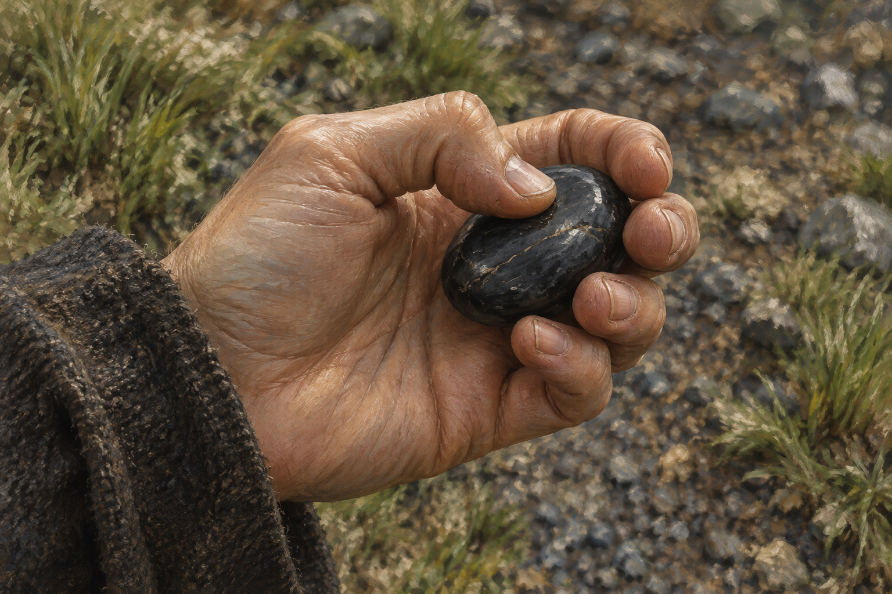

# 🖼️ 從今天所在之處開始

來源：《刺客正傳Ⅲ・刺客任務》（`book-farseer-trilogy_03`）第二十九章〈雞冠〉，meadow 第一輪閱讀。[完整心得](../../BookNotes/Library/media/book-farseer-trilogy_03/readers/meadow/chapters/0029/r1_2026-10-07.md)。蜚滋一手扶弄臣、一手握黑石，說出只能從今天所在之處行動後，才理解水壺嬸的棋局。

我選黑石，不是因為它能使過去變輕，而是它把眼前仍能做的事交還給手掌。此前他只看見盤面如何被下壞，現在開始看自己能放這顆石子的地方。塔洛的名字、對家人的恐懼與弄臣的自責都還在；下一步有可能，不表示所有傷害已被原諒。

參考 [古老公鹿石棋設定](../NovelIllustrations/farseer-trilogy_03/Props/old_buck_game.md)，只保留一顆磨滑深黑棋石與匿名成人手。拇指停在表面，沒有發光、預言符號或棋局勝利；棋盤與另一隻扶同伴的手在畫外。自然光、袖口與模糊步道為視覺詮釋，並非完整人物外觀或地理設定。這份專注有一隻手的尺度，不替敵人的威脅保證結局。

## 完整提示詞

Use case: illustration-story. New standalone landscape literary fantasy illustration for Assassin's Quest chapter 29. Narrative moment: during the walk, Fitz quietly rubs the single black game stone in his hand while realizing he can act from where he is today. References: old_buck_game; input image is a material and painterly style reference, use only one of its smooth deep charcoal-black stones, not its board, red or white stones. Extreme intimate close-up of exactly one cropped anonymous adult hand, palm cupped around one small naturally rounded polished dark stone, thumb gently touching its surface, anatomically correct five digits, quiet attention rather than tight combat grip. Plain worn dark wool sleeve cropped at edge, no face or body identity. Background softly blurred earth, grass and dark roadside gravel, mild natural spring daylight, restrained oil-and-gouache brushwork and cool earth tones. Stone has subtle ordinary reflected light, never emits light; preserve handmade slight irregularity, no rune or engraving. No other hands, people, animals, board, additional stones, crown, ghosts, weapon, prophecy, letters, labels, border or watermark. Exact hand appearance, sleeve, light and background are visual interpretation, not canonical character design or geographical map. No triumph or completed puzzle shown.

## 視檢

v1 已打開核對：單隻裁切成人手，拇指與四指可辨，一顆磨滑深黑石帶普通反光與細微石紋，與原設定一致。沒有棋盤、額外棋石、可辨識人物、字樣、魔法光或水印；模糊草地碎石與袖口只作詮釋，未畫出完整勝局。

