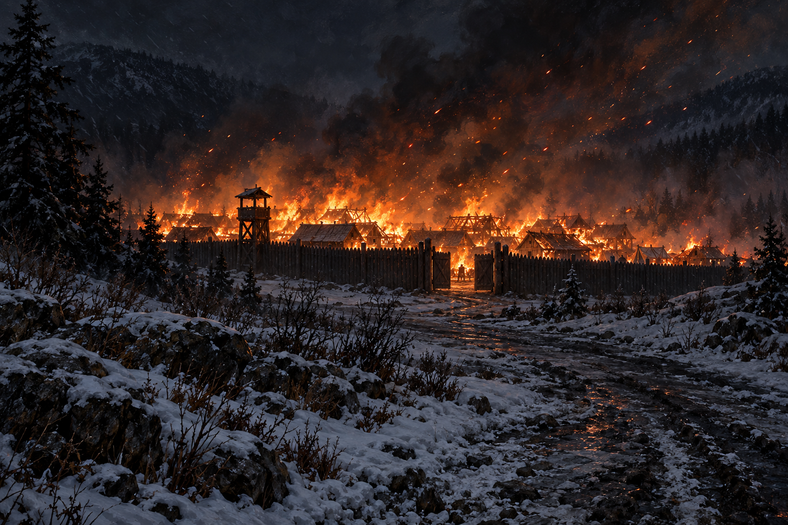

# 🖼️ 城外，仍在燃燒

來源為《刺客正傳Ⅲ・刺客任務》（book-farseer-trilogy_03）第十八章〈月眼〉。蜚滋、夜眼、椋音與水壺嬸已在逃離城鎮的馬車上，後方木柵欄成為橘色火光中的黑影，火星不斷升起。我選城外回望的視角，讓鏡頭裡沒有勝利者，卻看得見尚未停止的損失。

蜚滋不在乎博力的權力是否受挫，仍不能不看見城中商人、家庭與房舍遭殃。椋音將縱火理解為錦渥家族的復仇，對受賄與背叛也有推測；這張圖不替她補定每個縱火者。人逃出牢房是真實的好事，火吞掉他人的住處也是真實的災難，兩件事不能用一個催化劑稱號結清。

## 場景規格與引用

- 時點：三人一狼已出城、馬車持續遠離，回望月眼烈火；不合成前一場營地突襲與開鎖救援。
- references：[月眼邊境城鎮](../NovelIllustrations/farseer-trilogy_03/Props/moonseye_border_town.md)。
- 構圖：城外冬夜的寬幅遠景，黑色木柵欄與低層房舍、橘火與升起的火星，前景是暗色道路與雪，保留夜色留白。
- 所有人物、馬車、動物在畫外；無可辨識群眾，故不新增人物與坐騎設定，不將攝影位置當成已確認的地理點。
- 必須保留：規模小的木造城鎮、木柵欄、冬季風勢；火光不是魔法。畫面不呈現未確認的具名人物死亡或鎮外森林必已全部燒毀。
- 禁區：無石砌城堡、英雄剪影、凱旋旗幟、縱火者身分、軍徽、血腥遺體、幻象、未讀章節訊息、文字與水印。

## 生成提示詞與視檢

內建 imagegen，illustration-story。引用 moonseye_border_town_v1 的木柵欄、小型木哨台與低層木造小城；轉為強風冬夜、城外回望，低層房舍燃燒、橘火讓柵欄成黑影、火星隨風升起。暗色雪地道路近景，安靜遠離的視角與持續災害並存；寫實奇幻油畫。無人、無馬車動物、無英雄凱旋、無城堡旗徽文字水印、無魔法或具名死亡。

視檢 v1 通過：木柵欄、小型木哨台、低層房舍和敞開木門沿用設定；夜色雪路、強風火星與橘色火光可辨。無人、馬車、動物、軍徽、城堡、文字、水印或魔法；未呈現設定稿遠處水面，也未畫成周圍森林已全燒毀。

