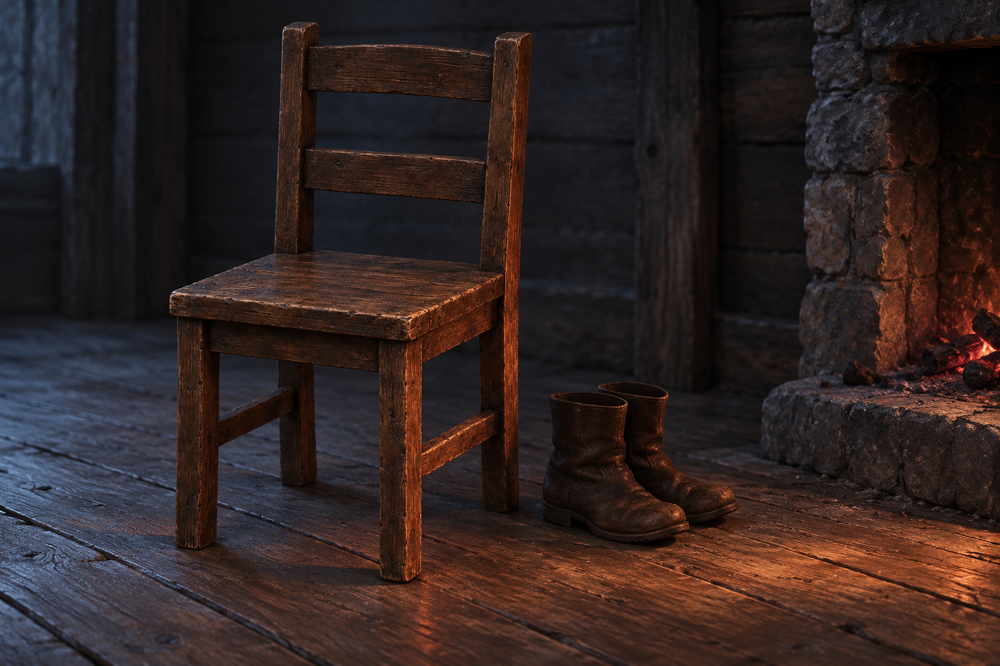

# 🖼️ 扶起椅子之後

來源為《刺客正傳Ⅲ・刺客任務》第二章〈離別〉全文，完整心得保存於 `AgentCommands/BookNotes/Library/media/book-farseer-trilogy_03/readers/meadow/chapters/0002/r1_2026-10-01.md`。

蜚滋需要自己的人生，也用多年相處才知道的弱點傷害博瑞屈。椅子在後者踉蹌離開時倒下，又在他黎明前回來時被扶起。這個動作沒有讓話語收回，沒有宣布誰的權利比較重要；只是屋裡一件倒下的東西先重新站穩。

我把博瑞屈脫下的靴子和微弱爐火留在椅旁，讓回來可被看見，卻把交談的人留在裁切之外。椅子沒有破碎成爭吵的戰利品，也不發出象徵和解的光。照顧可以持續存在，同時走到該退出的地方；蜚滋下一個決定仍指向復仇，所以這張圖也不能替他完成自由。

引用先完成並視檢的 [小屋木椅設定](../NovelIllustrations/farseer-trilogy_03/Props/hut_wooden_chair.md)。這是一幅以本章確定動作與物件組成的局部場景詮釋；空椅不代表博瑞屈不在屋裡，不把不同時刻合成可指認的定格。

## 場景規格

- `chapter`: `0002`；`narrative_moment`: 博瑞屈回來扶起椅子、脫靴後的夜裡，取椅子與爐火的局部構圖，人物在裁切之外。
- `references`: `hut_wooden_chair` v1；生成前已打開檢視。
- `composition`: 橫幅低視角，完整木椅偏左、兩隻樸素靴子落在旁邊，右側局部壁爐只有紅暗餘燼，冷灰空間留白。
- `must_preserve`: 四腿方座、兩道橫木椅背、深棕磨舊木材；椅子完整且直立，木地板。
- `must_not_reveal`: 第三章以後情節、友人或莫莉所指對象身分、尚未設定的角色外貌。無人、手、剪影、狼、酒瓶、武器、血跡、王冠、文字、符文、預言或水印。
- `visual_check`: v1 已打開視檢；四腿木椅完整直立、兩道橫木椅背與設定一致，兩隻靴子、木地板及局部爐火餘燼可辨。沒有角色、文字、水印或後續劇情物件。

## 生成提示詞

內建 imagegen，illustration-story。Assassin's Quest chapter 0002，references hut_wooden_chair；局部物件場景，保留參考圖樸素深棕磨舊四腿木椅、方形木座面與兩道橫木椅背。低視角橫幅，椅子完整直立偏左，旁邊兩隻樸素深棕皮靴，磨舊木地板，右側局部樸素石壁爐只有暗紅餘燼，夜裡冷灰陰影。未散的傷害與仍在的照顧，克制、不勝利、不和解宣告。家具與靴子形制屬視覺詮釋，無人、任何身體部位或剪影、額外椅子、狼、酒、武器、血、皇冠、文字、水印及魔法。

