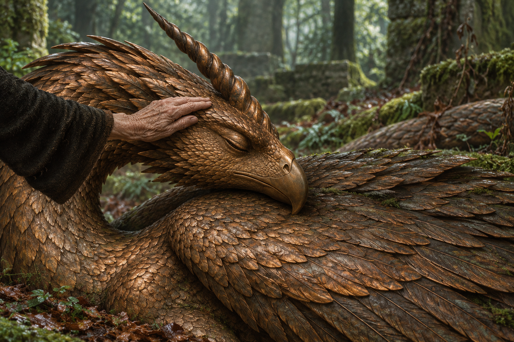

# 🖼️ 冷石之下，尚未明白

來源是《刺客正傳Ⅲ・刺客任務》（book-farseer-trilogy_03）第三十章〈石頭花園〉及 meadow 本章 r1 閱讀心得。圖取水壺嬸觸摸銅棕鷹喙獨角龍額頭的一刻：別人看見精雕細琢的美，蜚滋與夜眼感到生命與不安。我保留冷石的靜止，沒有把那份知覺畫成光束，也沒有讓牠睜眼替讀者作答。

一隻手能確認觸感，不能獨自決定眼前存在的全部。這個停頓也連著本章的對話：蜚滋終於聽見椋音的創傷與生計，卻仍需面對她不知道夜眼分享心聲的問題。聽懂一些，不等於已經懂得全部；承認疼痛也不替過往行為取消後果。畫面不將她的受難具象化，也不以寧靜森林保證關係已修復。

## 場景規格與提示詞（內建 imagegen）

chapter 0030；narrative moment：水壺嬸先觸額頭，尚未沿角向上撫摸。references: bronze_eagle_stone_dragon。以設定稿為實際圖像參考，保留銅棕細鱗、閉眼鷹喙、單螺旋額角、睡鵝回彎長頸與摺翼。橫幅三分之四近景裁切頭頸、角與上翼；一隻有皺紋的成人手從左側暗袖伸入，輕觸角下額部，龍頭尺度巨大、手相對小。早春潮濕森林、落葉苔蘚、冷綠斑駁光與節制銅色高光，寫實繪畫筆觸。人物臉、全身與其他生物全在畫外，袖口與手形、林木布局和光線為詮釋。不畫牡鹿人面像、裂痕、基座、醒來、發光、文字、水印或未讀章節資訊。

視檢 v1：單一閉眼鷹喙頭、一根螺旋角、摺翼及一隻老年手，手觸額部，無可辨識人物；森林苔蘚與落葉可見，無文字、水印、魔法或醒來結果。頭部尺度透過小手對比呈現，無其他石像混入。

