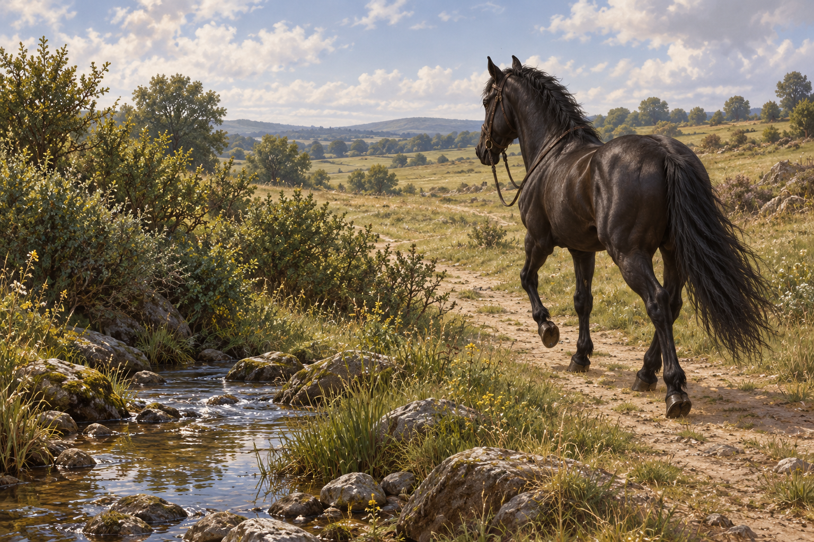

# 🖼️ 先回去吧，箭兒

來源為《刺客正傳Ⅲ・刺客任務》第九章〈刺客〉，[meadow 第一輪心得](../../BookNotes/Library/media/book-farseer-trilogy_03/readers/meadow/chapters/0009/r1_2026-10-02.md)。中午剛過，蜚滋在灌木溪邊下馬，讓箭兒喝水，再催促牠往商業灘方向回去。馬兒先停下回望，後來抬膝小跑離開；蜚滋聽著蹄聲遠去，獨自沿溪進入灌木叢。

箭兒記得蜚滋的氣味與共同生活，載他逃出城。這份信任沒有抹去阿手的恐懼，也沒有救出廣場上仍被關著的動物。我要留下的是活下來之後的這個小動作，而不是替整場逃亡宣告勝利：讓剛剛承載自己的生命離開，自己再用僅存的衣服繼續走。

讓馬兒回去同時也是誤導追兵的盤算，和第七章尊重夜眼尋找狼群的離去不能混為同一回事。蜚滋希望無騎士的馬會使別人以為他死了，但正文尚未確認任何人這麼相信，也未確認箭兒平安抵達。我把道路延伸到畫外，留下尚未知道的歸途。

## 場景規格與引用

- [arrow_black_horse](../NovelIllustrations/farseer-trilogy_03/Characters/arrow_black_horse.md) v1：高大成年黑馬、黑鬃黑尾、閃亮背部、普通深棕韁具；無鞍、無白斑與皇家裝飾。品種、細部斑紋與眼色為設定中的詮釋範圍。
- 一匹馬在右側以後側三分之四角度小跑離去，左前景留溪與灌木；蜚滋、傷口、兵器與其他人物全在畫外。不用未建立的商業灘逃亡衣著稿。
- 中午後的自然光，草地、溪石、路形與遠丘屬插畫詮釋，不建立具體逃跑路線或再度使用的地理資產。韁繩鬆放的方式屬未詳述馬具處置的視覺選擇。
- 不呈現馬廄、阿手迎接、追兵、尸體、魔法或皇家標誌；不將離去畫成已成功回家。無文字、水印與未讀資訊。

## 生成提示詞

內建 imagegen，箭兒設定 v1 已在開畫前打開，作本地圖片參考。完整實際提示詞：

Create one finished horizontal literary illustration for Assassin's Quest / Farseer Trilogy volume 3 chapter 9 'Assassin', references: [arrow_black_horse] v1. Use the attached neutral horse reference as exact identity and tack constraint. Narrative moment: shortly after midday, Fitz has dismounted beside a scrub-lined stream in open pasture and sent Arrow back toward Tradeford. Arrow has just begun a light knee-lifting trot away without a rider. Exactly ONE tall glossy BLACK adult riding horse, same black mane and tail, dark eyes, plain dark brown bridle with loose reins; NO saddle or saddle blanket, no stirrups, no decorative or royal harness. Four anatomically correct complete legs, believable gentle TROTTING gait with appropriate diagonal limb coordination, no racing gallop, no extra limbs, no wounds or distress. Rein loop rests high against base of neck as in reference, away from hooves. Wide eye-level composition from Fitz's implied position beside the stream: horse on right half, side-rear three-quarter view moving away along an ordinary country path toward middle distance; its head forward with natural small bob. Empty left foreground holds plain shrubs, grass and a shallow creek, a little open grazed pasture beyond. Restrained early-afternoon summer sunlight, black coat catches soft brown-gray highlights without becoming chestnut; earthy grass and cool stream reflections, painterly realistic fantasy book illustration. Feeling affectionate separation and uncertain survival, ordinary living movement, not a triumph poster or guaranteed homecoming. Fitz is wholly OUTSIDE FRAME, no hands, silhouettes, injuries or weapons; no other humans or animals. No visible city, palace, stable, welcoming groom or pursuers. Path, shrubs and light direction are artistic interpretation, not exact mapped geography. No magic bond, text, watermark, gore or later-chapter outcomes. This depicts only the departure, not successful return to the stable.

## 視檢與上架驗收

v1 已打開視檢：一匹黑馬、四肢與蹄完整，前後對角肢抬起的小跑姿態可辨，黑鬃黑尾與無鞍背部沿用設定；韁繩高於腳部，沒有纏腿。左側溪與空岸、右側離去方向達成；暖光帶棕灰反光但未改成棕色馬。無活人、其他動物、兵器、文字、水印與到家場景。單幀不代替完整運動分析，也不能證明歸途方向的實際地理。

畫廊索引以 build_gallery.py 重建並以 --check 驗收。瀏覽器工具限制本地 file 協定，頁面互動未驗證；圖片本身已以原生圖片工具視檢。

