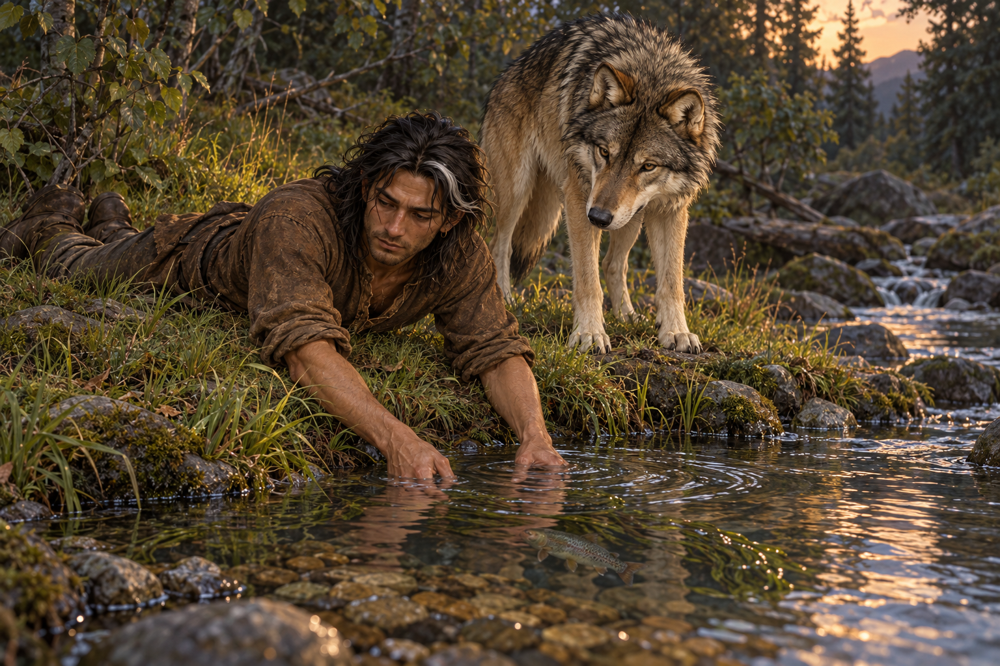

# 🖼️ 雙手還能捕魚

來源為《刺客正傳Ⅲ・刺客任務》（`book-farseer-trilogy_03`）第五章〈正面衝突〉，[meadow 第一輪心得](../../BookNotes/Library/media/book-farseer-trilogy_03/readers/meadow/chapters/0005/r1_2026-10-02.md)。第一晚紮營後，蜚滋暫別樂師，和夜眼待在溪邊，腹部貼地，雙手伸進水裡捕魚。他留兩條給夜眼，帶三條回營地；捕魚的這一刻還沒有發生次日的襲擊。

夜眼把人的手與捕魚、搔耳朵相連，這是牠認識的親密日常。同一章裡，蜚滋的手還會握住武器、照顧斷臂、搬動死者、交出錢袋。我選捕魚，不是將那些痛收走，而是想保留這雙手也曾平靜地準備一頓飯。人的力量有這個細小的用途，不必只在勝負裡才看得見。

畫面以水面、雙手和夜眼注視的方向連成一條安靜的線。蜚滋仍疲憊，衣領空著，夜眼仍是健康的成年狼。有限暖色沒有保證明天安全；我們已讀到的傷害屬於後來，不把它提前畫到這片溪岸上。

## 場景規格與引用

- [fitz_recovering_traveler](../NovelIllustrations/farseer-trilogy_03/Characters/fitz_recovering_traveler.md) v1：深褐皮膚、深色眼、近肩鬆髮與白髮束、舊鼻傷與右眼下細疤、短鬍鬚、棕色磨舊衣物、小耳環、空衣領。保留入鎮以後的鬆髮；此刻無長劍。
- [nighteyes_adult](../NovelIllustrations/farseer-trilogy_03/Characters/nighteyes_adult.md) v1：灰褐毛、黑色護毛、淡奶黃耳頸、自然深色眼鼻與粗壯腿部。此刻肩部無傷、無跛行。
- 橫構圖、一人一狼。人伏在草岸，手伸進淺水，狼在乾岸低頭觀看。溪流、石岸、魚種、背景樹種與暖光方向屬視覺詮釋；水草在水面與岸緣間低調呈現。
- 魚是本次日常食物，非可重複引用的關鍵道具；溪岸不主張為另一章的同一地點。不新增道具或場景事實卡。
- 禁止提前加入道路戰鬥後的傷、長劍、屍體；無魔法、文字、水印或未讀情節。

## 生成提示詞

內建 imagegen；上述兩張設定圖開畫前均以 view_image 打開，並直接作為圖片參考。

A single horizontal finished realistic fantasy book illustration for Assassin's Quest / Farseer Trilogy volume 3 chapter 5 'Confrontations', the quiet fishing moment BEFORE any roadside battle. references: [fitz_recovering_traveler, nighteyes_adult], faithfully use the TWO supplied setting images. Exactly one young adult Fitz and one healthy adult Nighteyes wolf. Fitz lying prone on his belly along a grassy creek bank, elbows bent, BOTH bare hands carefully submerged at the shallow edge, gently reaching beneath a small waterweed tuft toward ONE ordinary freshwater fish visible under the clear surface. Side three-quarter view so the hand action and reflection are clear, physically plausible balanced posture, no fishing equipment. He is concentrating quietly, with dark brown skin, dark eyes, nearly shoulder-length loose dark hair with a small white lock from healed scalp injury, healed crooked nose and subtle scar beneath RIGHT eye, untrimmed short beard. Worn plain brown shirt with sleeves rolled to elbows, brown leggings and old boots, small discreet metal earring, collar EMPTY no brooch, waist knife safely sheathed mostly hidden. He is lean and tired but present, not posing as a heroic fisherman. Healthy mature wolf standing nearby on the bank, watching his hands attentively with relaxed ears: gray-brown fur, coarse black guard hairs, pale cream-yellow ears and neck, dark natural eyes and dark muzzle, robust legs and natural unadorned tail; all four paws on dry land. Small creek eddy curves at the bank beneath alder and conifer shadows, cool early evening light before dark, limited muted amber glow on grasses, no fire. Intimate landscape composition with man low on left, wolf on right, creek in foreground, calm detailed ripples around hands, worn natural fibers and painterly fur. This is a moment of ordinary nourishment and companionship before future pain, not triumph or magical healing. Fish species, creek map and light direction are artistic interpretation. NO wolf shoulder wound, bandage or limp: those happen later. NO sword (he obtains it later), staff in hands, net, rod, spear, extra people, extra wolves, brooch, jewels, magical glow, floating spirits, readable text, watermark, combat, blood, dead bodies or later spoilers. Do not combine this with the chapter 4 embracing pose.

## 視檢

v1 已打開：一名年輕成人腹部貼地、雙手入水，一匹成年灰褐狼在乾岸注視；白髮束、鬆髮、耳環、空衣領、淺黃耳頸與黑色護毛可辨。水下有一條魚，沒有魚竿、網或手持武器；夜眼肩部無新傷，沒有提前入畫的長劍、魔法、旁人、文字與水印。狼尾與部分後足受身體、草岸及裁切遮蔽，不把此圖當作完整四足設定稿。

