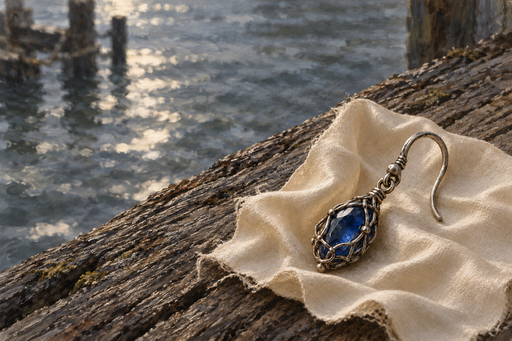

# 把過往收好

來源為《刺客正傳Ⅲ・刺客任務》第十章〈招募大會〉，[meadow 第一輪心得](../../BookNotes/Library/media/book-farseer-trilogy_03/readers/meadow/chapters/0010/r1_2026-10-02.md)。蜚滋在岸口得知耳環的自由人意義，也得知它能換來超過商隊費用的金塊。他離開商店，在碼頭附近吃麵包、思索耳環與博瑞屈、父親及耐辛的連結，最後將耳環裹进小片絲綢收起，以免成為辨識自己的特徵。

我想畫的是留下之後的收好，而不是向金錢高聲宣告勝利。他在挨餓，前方也還需要旅費，拒賣不是不受誘惑。耳環讓過往跟著他繼續走，但不能替他解除危險。有時珍惜不是展示，有時它只能藏在最小的布片裡。

耳環可能曾屬於博瑞屈祖母，是蜚滋的猜想；畫面不補前任持有者。自由人耳環也不是抽象的美麗象徵：本章商人解說，獲釋的人仍可能遭制度盤查，需要與家族刺青相應的證物。這個重量由文字承接，不在寶石上增添家徽、符文或神光。後來他以湯姆之名趕羊打水、換食物與商隊工作，才再次找到活到明天的方法；圖沒有把兩個時刻併成一幕。

## 場景規格與引用

- [freedman_sapphire_earring](../NovelIllustrations/farseer-trilogy_03/Props/freedman_sapphire_earring.md) v1：單一深藍寶石被細銀絲網住、上端有小鉤；切面、編織與磨損是詮釋，不換成红寶石別針或項鍊。
- 河岸近景裁切，耳環放在一片足夠裹住它的淡色絲布上，布邊尚未蓋住寶石；人物、手、腰帶小囊與其他珠飾全在畫外，沒有額外人物設定需求。
- 木材支承、河面反光、模糊繫船柱、絲布顏色及暫放姿態屬插畫選擇；不是正文指定碼頭地理，也不是認定他將首飾留在岸上。畫面暫停於收起前的一刻。
- 保留舊銀與小件珠飾的比例。無金幣、武器、文字、水印、魔法、博瑞屈祖母肖像、追兵或下一章結果。

## 生成提示詞與版本

使用內建 imagegen。開畫前已打開耳環設定 v1，作为身份與材質參考。v1 實際 prompt：

Use case: illustration-story. Create a finished horizontal painterly literary illustration for Assassin's Quest / Farseer Trilogy volume 3 chapter 10 'Hiring Fair', references: [freedman_sapphire_earring] v1. Input image is a PROP IDENTITY REFERENCE, not an edit target: keep this single small oval deep blue sapphire enclosed in intricate tarnished SILVER wire lattice, the thin simple hook and tiny connector rings, age and fine craftsmanship. Narrative: beside the river near the docks of Riverend, Fitz has refused to sell the earring for the money that could fund his journey; he is wrapping the precious link to his upbringing and father in the smallest retained piece of silk to hide it in his belt pouch. Depict an intimate unpeopled close-up paused just BEFORE the silk covers it: ONE small ear-sized earring lying diagonally in a tiny irregular plain worn muted pale silk scrap, one loose silk edge partly folded toward it without obscuring the sapphire or hook. Silk and earring rest on an ordinary weathered timber edge beside a river, occupying the lower-right third. Timber support and neutral pale silk color are artistic interpretation only, not a fixed geographical or textual fact. Upper-left two thirds open onto a softly blurred gray-blue flowing river, distant nondescript mooring posts blurred enough to be barely identifiable. Natural restrained daylight, a quiet silver reflection on water, thin warm light grazing cloth and wires; no magical glowing gem or dramatic divine spotlight. Intimate mundane scale, real tiny wearable jewelry not a huge gemstone on a huge bed sheet. Realistic fantasy BOOK ILLUSTRATION with visible oil and gouache brushwork and paper texture, not a glossy commercial jewelry photo. Muted earth, worn wood, cool river-gray and small deep sapphire blue accent. The relationship is retained but the escape is not secure; a thoughtful pause, not a celebration of wealth or guaranteed homecoming. Exactly one earring, no other jewelry, coins, ring, medallion, weapons, pouch or scroll. Fitz, all hands, identifiable humans, horses, wolves and family members wholly outside frame; do not invent ancestral scenes. No palace, slave marks, family crest, typography, inscription, border, title, text or watermark. No later chapter outcomes. Consistent earring design with the input reference; shift material highlights toward cool aged silver, no new gold parts.

v1 已視檢：耳環與構圖符合，布料卻呈疏鬆粗麻紋路，不作最終上架圖；[保留初稿](../RawImages/meadow_farseer_trilogy_03_keep_the_link_v1.png)。v2 針對絲綢材質修正，完整實際 prompt：

Precise object/material edit of the attached illustration. Change ONLY the fabric scrap beneath the earring: it must be a very small piece of old SILK, not burlap, linen, gauze or coarse cotton. Replace the coarse open mesh weave and fuzzy rag with thin densely woven smooth pale ivory silk, subtle soft satin sheen, gently wrinkled fine folds, thin edges and a few delicate frayed threads. Silk is an inexpensive retained scrap, not a luxurious huge drape. Preserve the exact single tarnished SILVER wire-wrapped BLUE SAPPHIRE earring, hook, tiny connector rings and position. Keep the same weathered timber ledge, river and out-of-focus mooring posts, daylight, horizontal framing and quiet painterly literary illustration style. No hands, people, coins, jewelry additions, words or watermark. No magic glow. The smallest silk scrap should remain just large enough to wrap the one earring.

## 視檢與驗收

v2 已打開視檢：單一耳環的藍寶石、銀絲包網、鉤與連接環沿用設定；布料由初稿疏鬆粗麻紋修正為更細密、有柔亮反光的薄絲布，保留舊布的細小毛邊。耳環尺度與布片可相互對照，河面留白、木材與繫船柱為場景詮釋，沒有人物、手、金幣、家徽、魔法、文字或水印。畫面是裹起前的靜物裁切，不將耳環留在河岸解讀成正文後續。

畫廊索引以 build_gallery.py 重建並以 --check 驗收。

