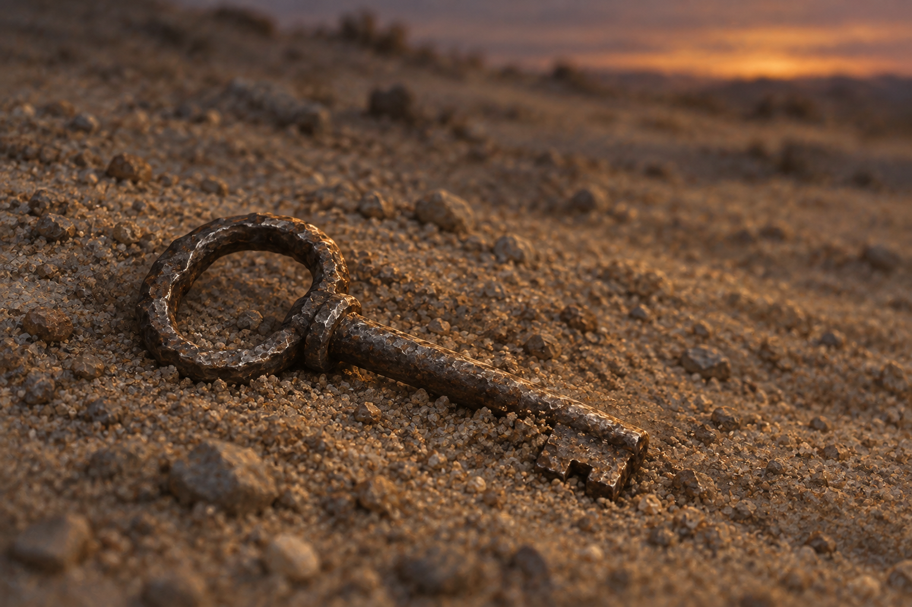

# 🖼️ 鑰匙不替人赦免 (A Key Without Absolution)

來源為《刺客正傳Ⅲ・刺客任務》（book-farseer-trilogy_03）第十二章〈嫌疑〉。蜚滋被俘後，一名年輕侍衛曾拿水與鑰匙請他解除想像中的詛咒；得知是毒、也無法獲救後，男孩將鑰匙拋遠。蜚滋直到夕陽將沉才找到這枚粗製、難轉卻仍可用的鑰匙。這張圖停在沙地裡的一個微小發現，不把求生的機會擴寫成勝利。

我讀到的痛處，是蜚滋無法用波爾特的名字代替所有死者。對方的暴行確實存在，他阻止對方割喉也確實救了自己，但下毒在被捕前就已發生，而年輕侍衛的哭声此後仍留在他心裡。鑰匙讓身體有可能離開鐐銬，沒有替記憶發出離開的許可。

因此只讓薄薄的夕照擦過一小段金屬。它可以被看見，卻不發光替人宣判。周圍大片不顯眼的沙地保留搜尋一整天的艱難；人物、鐐銬與死者都在畫外，失去由心得承接。畫外不是那些生命沒有重量，而是我希望這幅圖讓求生與責任一起留下。

## 場景規格與引用

引用 [粗製鐐銬鑰匙設定](../NovelIllustrations/farseer-trilogy_03/Props/rough_shackle_key.md)，設定 id `rough_shackle_key`；開畫前已打開設定稿，並將暗灰磨舊金屬、橢圓圈柄、接柄小肩台、短直桿與單一缺口齒重述於 prompt。材質、形制、沙粒與低角度光線均為插畫詮釋，正文只指定鑰匙粗製、可用與夕陽前尋回。

只畫沙地與一枚鑰匙，停在拾起前；無人物、手、傷口、死者、馬群、毒藥或其他道具。耳環另已尋回戴上，不移入這個裁切；沒有抵達藍湖、治癒或團聚的畫面。

## 生成提示詞

內建 imagegen，以已視檢的鑰匙設定稿作視覺參考；完整實際 prompt：

Use case: illustration-story. Create a quiet, realistic painterly literary fantasy book illustration for Assassin's Quest / Farseer Trilogy volume 3, chapter 12 Suspicion. Narrative moment: after a long desperate search, just before Fitz finds the crudely made key thrown into inconspicuous sandy earth as sunset fades. References: [rough_shackle_key]. The attached image is a PROP DESIGN REFERENCE ONLY, not a composition target. Preserve exactly its single old dark dull iron key: uneven simple oval loop bow, small collar at the join, short straight round stem, and single rectangular bit with one coarse notch. Depict exactly ONE modest palm-length key lying diagonally in ordinary dry brown-gray sandy soil with tiny irregular pebbles and shallow disturbed grains, its lower edge lightly covered with grains yet its complete recognizable shape still mostly visible. Ground-level close view, key small enough to occupy roughly one quarter of the width, foreground crisp and surrounding sand stretching into generous quiet soft focus. Restrained low sunset light grazes a worn edge of iron, long subtle cool shadows; no sun disk necessary, no dramatic shaft or supernatural glow. Muted ocher, cold gray, iron charcoal, subdued warm light, fine visible painterly texture. The emotional focus is a thin chance of survival after irreversible loss, exhausted attention, not conquest, purity, absolution, or triumphant treasure discovery. Exact material and form, granular landscape and lighting are illustration interpretation; do not add invented historical marks. No people, hands, bodies, blood, animals, water flask, earrings, shackles, chains, locks, weapons, campfire, wagon or other narrative objects in the crop. Do not show later escape, Blue Lake, reunion, future healing, magical curse, or montage. No text, letters, runes, labels, border, or watermark. One coherent moment and one object, landscape composition.

## 視檢

v1 已打開檢查：只有一枚鑰匙，圈柄、接柄肩台、短直桿與缺口齒保留設定輪廓，暗灰金屬表面只有夕照反光。沙粒與小石子圍繞，遠景模糊，無人物、鐐銬、死者、其他物件、文字或水印。鑰匙在構圖中比 prompt 期望更大，仍是單一無人近景，未影響章節時點與敘事界線，因此保留 v1；不以畫面推定鑰匙的實際尺寸。

