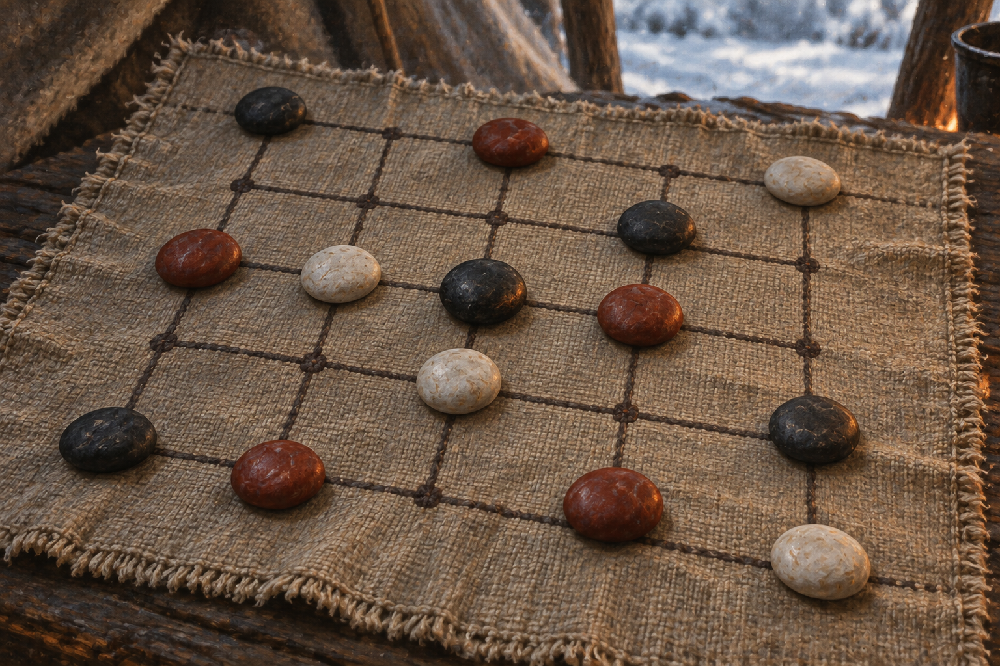

# 🖼️ 一顆黑石的策略

來源為《刺客正傳Ⅲ・刺客任務》第二十五章〈策略〉，[meadow 第一輪心得](../../BookNotes/Library/media/book-farseer-trilogy_03/readers/meadow/chapters/0025/r1_2026-10-06.md)。暴風雪讓眾人暫居古道旁，水壺嬸用棋局使蜚滋維持清醒。夜眼看著紅、黑、白石子，沒有照搬棋譜，而是把盤面理解成狼群追捕獵物的局勢，指向能封住陷阱的一步。

我把畫面停在黑石剛落下的時刻：布面格線交點上的一顆黑石與周圍紅、白石子構成緊密的空隙。視角讓人能看見位置之間的牽制，卻不畫手、棋手或真實獵物。這顆石子不是勝利獎章；它保存的是夜眼用自己的視角理解共同難題，而蜚滋仍得花時間學會如何看見那套策略。

石子的三色、光滑表面、布面格線與交點依 `old_buck_game` 設定；石材、布料、石子數量與實際盤面排列是視覺詮釋，不冒充原文未列出的精確棋局。場景不畫狼、人狼融合、文字或發光魔法，也不把暴風雪、精技道路與之後的旅途拼成同一瞬間。

## 場景規格與引用

- [old_buck_game](../NovelIllustrations/farseer-trilogy_03/Props/old_buck_game.md) v1 設定稿先行生成與視檢。沿用磨滑的紅、黑、白石子與有格線交點的布面；設定圖為一般陳列，不沿用其石子位置作為正文原局。
- 取蜚滋理解夜眼策略後的一局近景，只畫棋盤、石子與少量帳篷布面背景。以黑石和紅白石間的空隙呈現「關閉陷阱」；不畫人物、手、狼或獵物，避免把比喻變成實際狩獵場景。
- 柔和低火光與冷色陰影作為冬日營地氛圍，不畫精技光效、勝負標記或後續道路。

## 生成提示詞與版本

內建 imagegen；開畫前已打開並視檢 `old_buck_game_v1.png`，並在 prompt 中重述設定稿的布面格線交點、三色光滑石子與手工材質。完整 prompt：

> Use case: finished literary fantasy reflection illustration for Assassin's Quest / Farseer Trilogy volume 3, chapter 25 "Strategy". Reference: old_buck_game_v1, opened and visually inspected. Preserve a simple woven cloth board with visible crossing grid lines, and smooth handmade stones in muted red, charcoal black, and chalk white. Depict one quiet close moment after the wolf companion has recognized the game as a hunting party: a single black stone has just taken the strategically important intersection that closes a trap among the red and white stones. Arrange the surrounding stones to suggest a subtle encircling route through negative space, but do not reproduce a specific exact board position from the novel because the full layout is not specified. Three-quarter overhead close composition, the decisive black stone in sharp focus, the other stones legible but understated. Only a narrow hint of rough tent cloth and cold snowy daylight beyond the board; a very faint warm reflected fire tone may touch the stones. The insight comes from seeing relationships and possible moves, not from magic. Preserve the object reference's modest, handled natural stone surfaces and cloth grid. No people, hands, wolf, paw prints, prey, literal hunting scene, glowing effects, energy strands, symbols, text, labels, lettering, frame, or watermark. Restrained painterly oil-and-gouache book illustration with paper grain, muted winter palette, intimate reflective mood, not glossy concept art. No events beyond chapter 25.

## 視檢與驗收

v1 已打開檢查：布面格線、紅黑白石子與設定稿一致；中心黑石清楚，無人物、狼、手、獵物、文字或水印。空隙構圖呈現關鍵位置但不宣稱是正文精確盤面。

