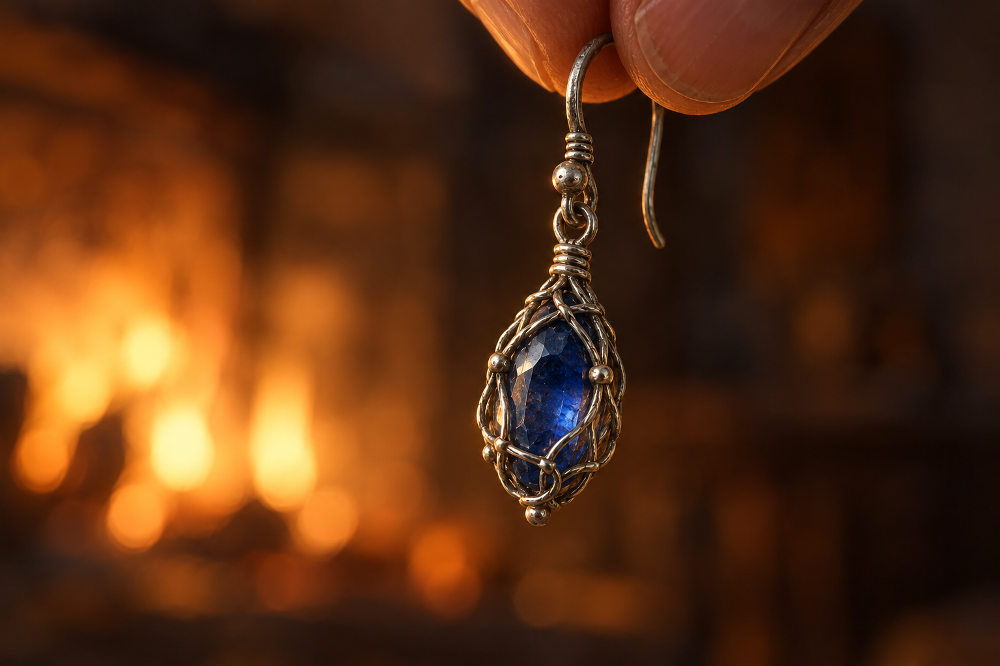

# 🖼️ 讓連結成為路費 (The Price of Connection)

來源為《刺客正傳Ⅲ・刺客任務》（book-farseer-trilogy_03）第十四章〈走私者〉。蜚滋把耳環的小鉤拎在爐火前，讓尼克看銀網與藍寶石，最後承諾兩人安全抵達河對岸才交出它。現有錢幣先作擔保，耳環是唯一報酬；章末它仍戴在蜚滋耳上，路程尚未開始。

第十章留下它，是保存與父親和博瑞屈的連結；第十四章準備讓它離開，也是為了找到惟真。這兩個選擇不必互相否定。惟真的命令仍然有效，蜚滋也開始說自己想為惟真本人而去，不能把這份心意寫成強制已消失。遺物的重量沒有變輕，卻可能被他帶進另一種承諾。

這幅圖不畫尼克伸手，也沒有金幣與抵達對岸的風景。藍寶石仍只反射爐光，一段關係沒有因價格被抹掉；正式承諾則還要用危險的路程來履行。只留極少量指尖，讓耳環正在被舉起的狀態可理解，不新增可辨認人物。

## 場景規格與引用

引用 [自由人藍寶石耳環設定](../NovelIllustrations/farseer-trilogy_03/Props/freedman_sapphire_earring.md)，設定 id `freedman_sapphire_earring`。開畫前已打開 v1 設定圖，重述單一深藍寶石、精緻細銀絲網、小鉤與連接環；銀色不改成金色，寶石不发光。

微距近景：一枚耳環垂懸，画面頂緣只見成人拇指與食指的極小部分，不構成可辨認人物，不補蜚滋的新髮型、傷疤或衣著。背景只有模糊爐火暖光；指尖細節、構圖與反射為詮釋。沒有其他人物、金幣、武器、家徽、文字或夢境拼貼。不合成後來戴回耳上、移交耳環或渡河的時點。

## 生成提示詞

內建 imagegen，以既有耳環設定稿作視覺參考；完整實際 prompt：

Use case: illustration-story. Literary fantasy illustration for Assassin's Quest, Farseer Trilogy volume 3 chapter 14 Smugglers. Narrative moment: Fitz lifts his precious inherited sapphire earring by its little hook before the farmhouse hearth during bargaining, BEFORE the bargain is fulfilled. References: [freedman_sapphire_earring]. Attached image is the PROP DESIGN REFERENCE: preserve exactly ONE small oval deep-blue natural non-glowing sapphire enclosed by intricate fine SILVER wire net, tiny upper hook and connection ring, old skillful restrained jewelry, no gold additions, no crest or runes. Macro close-up, earring hanging freely and vertically from its tiny hook, held gently between just the very ends of a cropped adult thumb and index finger at the TOP edge of the frame. Only those small fingertip portions visible, no whole hand, sleeve, face, body, tattoo, scars, rings, identity or character design; no other people. Gem and woven silver net crisp in foreground, a distant farmhouse hearth fire becomes soft indistinct amber and deep-brown blur, no literal room layout or fireplace ornament. Slight asymmetry, generous dark quiet space around the small object, fine painterly brushwork, believable tangible metal, realistic historical fantasy book art, muted silver gray and deep sapphire blue contrasted with restrained warm reflected firelight. Emotion: the cost of letting an inherited connection become a chance to reach a loved person; serious deliberation, no triumphant wealth or grief magically solved. One temporal moment, not handing it to Nick, not showing the later earring on an ear, not crossing a river. No coins, moneybag, other jewelry, silk, tools, weapons, visible furniture, people, corpses, child or dream montage. Sapphire does NOT glow; no supernatural light rays. Fingertips and light are artistic interpretation, not newly asserted anatomy. No text, lettering, symbols, border, labels or watermark. Landscape composition, tasteful macro scale, no oversized jewel.

## 視檢

v1 已打開檢查：只有一枚藍寶石耳環，銀絲包網、小鉤與連接環均保留既有設定；頂緣只見捏住鉤子的指尖，沒有可辨認人物或其他首飾。火光為模糊背景，寶石為普通反射，無魔法光、文字或水印。金屬局部受暖光染色，仍保留灰銀高光，不新增黃金材質。

