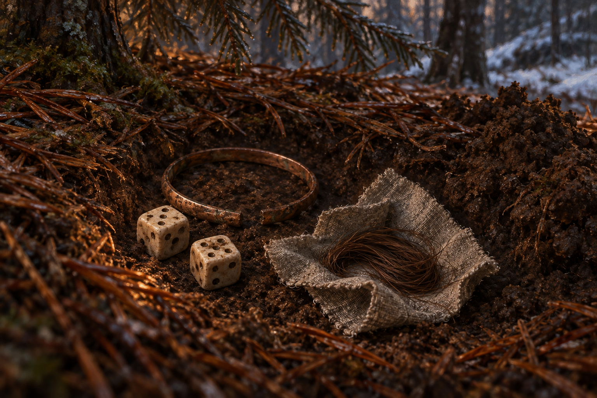

# 🖼️ 她也有自己的生活

第十九章〈追捕〉中，蜚滋從女兵的錢包取出私人小物，將骰子、斷手鐲與布包中的細髮埋下。我選尚未覆土的一刻：鏡頭不追問髮束属于谁，只停在這些曾被珍藏的東西上。她曾是威脅，也有命令之外的生活；這份遲來的看見不能讓殺戮變得無事發生。

章末夜眼拒絕讓蜚滋消失在自己的身體裡，仍帶食物、拾柴與陪他走。那是另一種承認各自生命的方式。本圖只畫前段埋小物，不把後段箭傷、兔子或小火拼接成同一時點。

## 場景規格與引用

- references：[女兵的私人小物](../NovelIllustrations/farseer-trilogy_03/Props/soldier_private_keepsakes.md)，設定稿已先繪與視檢。
- 時點：三株大冷杉的遮蔽處，小物已放入淺土穴，覆土之前；人物、手與夜眼全部在画外。
- 近景只見厚落針、暗土、周邊樹根與少量遠處雪。裁切不要求數出三株樹，亦不借第十七章藏身處指定地理位置。
- 沒有錢幣、打火石、錢包、武器、遺體、墓碑或髮束主人肖像。小土穴不是人體墓穴。
- 銅色鐲、灰麻布、棕髮、骨色雙骰、淺穴形狀、物件位置、暮色與畫外微暖光皆為詮釋；不補女兵姓名、家庭與獲得遺物的故事，不暗示赦免或已安全。

## 生成提示詞與視檢

內建 imagegen，引用 soldier_private_keepsakes_v1.png。寬幅寫實奇幻文學油畫，冬季冷杉遮蔽下地面近景，兩枚素骨色骰子、一只缺口暗銅色細鐲、灰小麻布內的棕色細髮，緊靠置於新開淺土穴。厚褐色冷杉落針，穴旁少量掘出的土，遠處僅一角雪；自然冷暗暮色與畫外火光的克制暖色，安靜粗舊質感。物件直接接觸森林土壤，不是桌面設定展示。承認匿名死者的私人生活，不畫勝利或赦免。無人物、手、狼、遺體、錢包、錢幣、打火石、武器、墓碑十字架、文字、徽記、肖像、魔法光、光環與水印；不補髮束主人的身分。

v1 已視檢：道具沿用設定，清楚置於落針包圍的淺土穴，單一細鐲保留斷口、髮束在灰布上、兩枚骰子；邊緣有雪，未出現額外道具、人物、文字或魔法。暖光與樹根布局是畫面詮釋。

