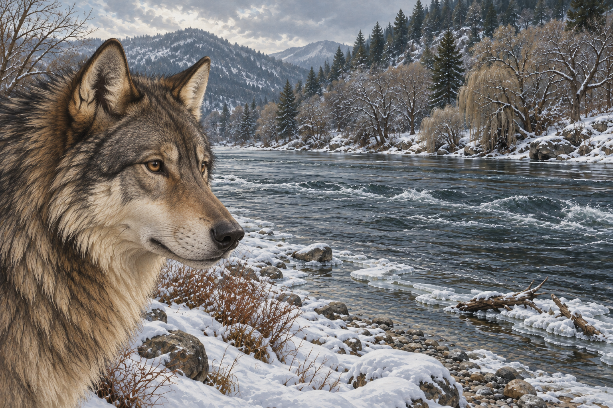

# 🖼️ 先看見一匹狼

來源為《刺客正傳Ⅲ・刺客任務》（book-farseer-trilogy_03）第十六章〈避難處〉。兩人沿河拾柴時，蜚滋發現自己有時先看見一匹狼，才看见熟悉的同伴。夜眼的成熟不讓牽繫消失，卻使這份關係多了一點尊重。我想留下牠看向河流的安靜，不將狼的獨立性化成等待主人下令的忠犬姿態。

本章也讓時間繼續流動：莫莉的日子不會因蜚滋遠行停止，椋音對安定生活的渴望也不是毫無成本的自由。水壺嬸談循環與催化劑，是她收集的教說；插圖不把它變成全知的時間輪。河水持續流，對岸仍未抵達，讓暫時的庇護與未完成的路並存。

## 場景規格與引用

- 敘事時點：第二晚抵達河岸破屋之後，沿河拾柴途中；選取觀看河流的停頓，不合成後來遊戲、警戒、捲軸與精技夢。
- references：[成年夜眼](../NovelIllustrations/farseer-trilogy_03/Characters/nighteyes_adult.md)、[雪河岸](../NovelIllustrations/farseer-trilogy_03/Props/snow_river_bank.md)。
- 構圖：寬幅、夜眼頭頸位於近景一侧，遠處保留湍急河水與林木對岸；頭頸裁切在肩部之前。蜚滋與獵物全在畫外。
- 必須保留：灰褐底毛、黑色護毛、淡奶黃耳頸、成年狼輪廓、自然深色眼鼻；河流未完全封凍。
- 禁區：不把舊左肩傷畫成已痊癒，不畫項圈或狗的服從姿態、魔法牽線、發光眼、渡河成果、未讀角色、可讀文字與水印。
- 光線、岸石位置及狼的觀看角度為插畫詮釋，不宣稱是正文逐字描述的固定姿勢。

## 生成提示詞與視檢

內建 imagegen，illustration-story。以已視檢的 nighteyes_adult_v1 與 snow_river_bank_v1 為角色及場景參考；雪河岸的自然冷灰光下，單一成年灰狼頭頸近景凝視河流，肩與四肢均在畫幅之外。保留灰褐毛皮、黑護毛、淡奶黃耳頸、深棕眼和黑鼻口。河流占有足夠留白，岸冰和對岸樹木清楚；細膩寫實奇幻油畫。無人、無獵物、無項圈、無人狼混合、無魔法、無渡船橋梁、無文字水印。

視檢 v1 通過：只有一匹成年夜眼的頭頸，灰褐毛、黑護毛、淡奶黃耳頸與自然深色眼鼻一致；畫幅不呈現左肩、四肢或傷口。水流、岸冰與林木對岸沿用場景稿，無人、獵物、項圈、魔法、橋船、文字或水印。

