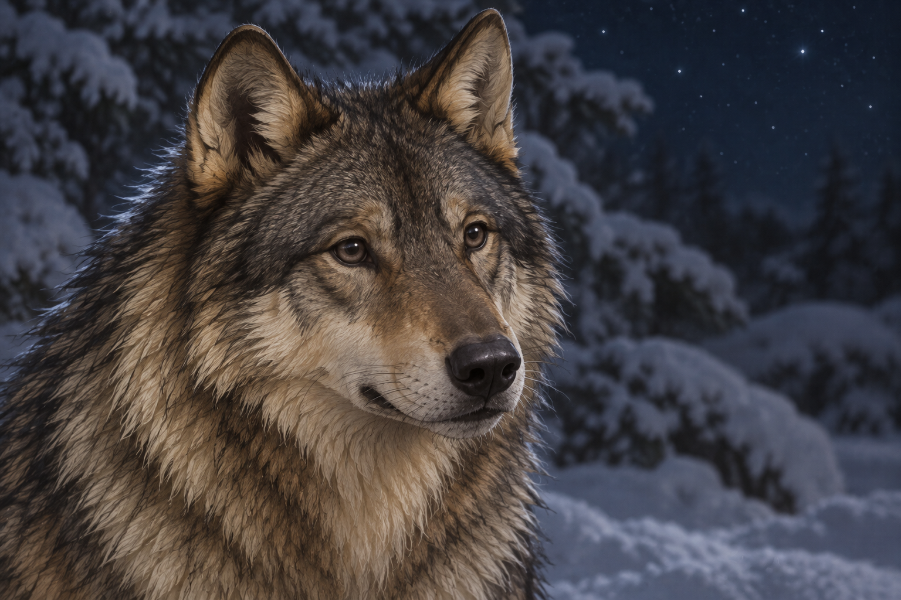

# 🖼️ 你回來了，召喚也在 (Reunion and the Summons)

來源為《刺客正傳Ⅲ・刺客任務》（book-farseer-trilogy_03）第十五章〈水壺〉。雪已停止，蜚滋在夜宿的舊羔羊屋外與夜眼重逢。撲倒、玩鬧與搔耳之後，牠望向他，承認自己也無法再忽略惟真的召喚。牠曾獲狼群接納、共同狩獵與分食，黑狼仍是首領；回到蜚滋身旁沒有替牠完成另一個自由的選擇。

我想保存這份完整感，也不把它當成取消內疚的答案。蜚滋想讓牠過自己的日子，牠卻想讓他們過共同的日子。原智與精技如何讓約束穿過彼此，他們仍不明白；一體的親密不能自動替另一個生命接受召喚。

因此畫面沒有籠子、鐵鏈或魔法線，只有風吹動的毛與望向畫外朋友的雙眼。約束由章節心得承接，不把內心比喻當作實體道具。夜眼不能解決帝尊的追捕，仍能在蜚滋發抖後讓他試著睡；圖像停在更早的雪地交談，沒有合成屋內技傳或後續逃亡。

## 場景規格與引用

引用 [成年夜眼](../NovelIllustrations/farseer-trilogy_03/Characters/nighteyes_adult.md)，設定 id `nighteyes_adult`。開畫前已打開 v1 設定稿，重述成熟灰褐狼、黑色護毛、耳頸淡奶黃、深色眼鼻與自然狼臉。沿用的是頭頸外型，不將第三章的健康狀態套為第十五章已痊癒。

只畫頭部與上頸，底邊在肩部之前裁切；[左肩受傷狀態](../NovelIllustrations/farseer-trilogy_03/Characters/nighteyes_left_shoulder_injured.md)的傷與腿均不入畫，不新增痊癒或疤痕。蜚滋、修髮後服裝與其他角色全在畫外；一匹狼，無幼犬比例、項圈、藍光眼或飾物。雪覆枝條、光線與相對位置為插畫詮釋。正文此時雪已停，不畫暴風雪仍在飄落。

## 生成提示詞

內建 imagegen，以既有成年夜眼設定稿作視覺參考；完整實際 prompt：

Use case: illustration-story. Quiet literary fantasy illustration for Assassin's Quest, Farseer Trilogy volume 3, chapter 15 Kettle. Narrative moment: after the joyful reunion outside the old sheep shelter, Nighteyes sits in snowy darkness and looks toward Fitz, discussing their shared life and the king's unwanted summons. References: [nighteyes_adult]. Attached adult wolf image is a CHARACTER DESIGN REFERENCE, not a composition target. Preserve exactly ONE mature gray-brown wolf, coarse black guard hairs scattered in the coat, pale cream-yellow fur around ears and neck, naturally very dark eyes, dark nose and muzzle, mature long wolf face and triangular ears. A TIGHT HEAD AND UPPER NECK portrait ONLY, with the bottom of the image cutting off ABOVE the shoulders: no shoulders, legs, paws, back or tail visible. An older LEFT shoulder injury is unresolved in the read text; do NOT show it or imply healing, do not invent scars. Eye-level three-quarter view with wolf turned slightly toward a human companion entirely outside the crop, alert gentle ordinary animal expression, natural lips closed, no human smile or literal tears. A breeze lightly stirs neck fur. The snow has STOPPED falling, night wind has cleared the sky; soft blurred snow-covered branches behind the head and subdued cool starlight reflections in the snow, fine natural catchlight in the eyes, no glowing eyes or magical aura. Restrained gray-blue night, muted brown and cream fur, realistic painterly fantasy book art, fine brush texture, sensitive living presence, low light still readable. Emotional focus: reunion and intimate recognition alongside unresolved loss of freedom, not triumphant healing or solitary howling. Fitz, his new haircut and winter clothes, all people, other wolves, horses and wagons completely outside crop. No cages, chains, magical links, symbols, weapons, buildings, visions or physical king. No collar, harness, clothing, armor, puppy proportions, blue eyes, white wolf coat, moon disk, snowstorm, text, letters, border, label or watermark. One single coherent moment. Landscape frame, intimate head portrait with quiet breathing room.

## 視檢

v1 已打開檢查：單一成熟夜眼的頭頸近景，灰褐毛、黑色護毛、淡奶黃耳頸、自然深眼與鼻口保持設定。畫面下緣有頸部濃毛，肩部傷口與承重姿態不可辨，不把無可見傷口解讀為復原。沒有其他角色、項圈、魔法光、實體籠子、文字或水印；背景為積雪枝條與星夜，沒有降雪中的暴風。凝視方向指向畫外，不合成後續技傳。

