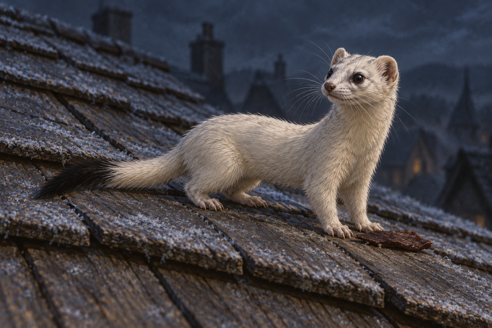

# 🖼️ 警告送到了，悲痛仍在 (The Warning Arrives, Grief Remains)

來源為《刺客正傳Ⅲ・刺客任務》（book-farseer-trilogy_03）第十三章〈藍湖〉。蜚滋準備從旅店屋頂進入他以為帝尊所在的房間，小白鼬及時送來陷阱警告。牠的牽繫夥伴已死，最後交付的任務卻仍在牠心裡。蜚滋回到屋頂，邀牠同行，並把乾肉放下給牠；牠不願放棄復仇的目標，後續結果尚未讀。

這隻小動物讓我覺得援手不必先處理好自己的悲痛才能抵達。牠幫了蜚滋，也還是孤單而憤怒。那條乾肉只是他此刻能給的照料，不能換成牠已願意同行，也不能讓失去的夥伴回來。畫面因此停在食物與警覺之間，不用齜牙或發光把牠變成勝利的符號。

本章稍後，椋音也終於說明自己幫蜚滋的另一個原因：他曾讓她弟弟傑多活一段時間。不同的生命各自帶著沒說完的失去；這張图只選小白鼬送信後的片刻，不把弟弟、莫莉夢境或旅店晚餐疊入屋頂。照料有它很小、仍值得保存的尺度。

## 場景規格與引用

引用 [小白鼬信使設定](../NovelIllustrations/farseer-trilogy_03/Characters/little_weasel_messenger.md)，設定 id `little_weasel_messenger`。開畫前已打開設定稿，重述象牙白毛、小黑尾尖、細長身體、短腿、小圓耳、灰粉鼻與深色不發光眼。毛色與尾端均為詮釋；正文沒有逐項指定。

一隻小白鼬、一條乾肉、微霜杉木屋瓦；蜚滋全在裁切之外，沒有手、工具、武器或其他角色。屋瓦排列、微弱反光與構圖為詮釋。乾肉為這次短暫照料的配角，不新增固定器具設定。牠警覺但沒有攻擊，不畫已殺帝尊、與人同行或被治癒的結果。

## 生成提示詞

內建 imagegen，以已視檢的小白鼬設定稿作視覺參考；完整實際 prompt：

Use case: illustration-story. A realistic painterly literary fantasy book illustration for Assassin's Quest / Farseer Trilogy volume 3, chapter 13 Blue Lake. Narrative moment: after delivering the warning that the inn is a trap, the little weasel remains on the inn roof while Fitz puts a strip of dried meat down for it. References: [little_weasel_messenger]. Attached image is the creature DESIGN REFERENCE ONLY. Preserve ONE tiny ivory-white weasel with a slim elongated body, four short little clawed legs, one long tail ending in a black tip, small round ears, whiskered muzzle, gray-pink nose and ordinary dark eyes. Full animal visible and naturally proportioned. On weathered overlapping cedar roof shingles lightly edged with frost, one small dark-brown strip of dried meat rests just before its forepaws; animal pauses near the food, head lifted attentively toward the person outside the crop. Low close three-quarter side view, modest diagonal roof slope with animal secure, no imminent fall. The warm living creature contrasts with a vast quiet blue-gray night, small subtle reflected light from an inn window BELOW and OUTSIDE the crop, no bright visible window, no literal glowing aura. Restrained natural light, soft dark distant rooftops out of focus, muted ivory, old cedar brown, blue-gray shadows, fine painterly brushwork. Mood: alertness, grief and a brief act of care amid unfinished danger. Not cartoon cuteness, fierce combat, triumphant assassination, healed grief or reunion. Human Fitz completely outside crop, no human hands, clothing, silhouettes or shoulder under animal; no other animals, no wolves, no dead companion, no Regal or Will, no visible weapons, climbing tools, blood, traps or poison. Roof configuration, coat and black tail tip are artistic interpretation, not asserted book facts. No magical ribbons, supernatural eye glow, montage, inscriptions, letters, text, labels, borders or watermark. One coherent moment, landscape frame, no later revenge outcome.

## 視檢

v1 已打開檢查：只有一隻小白鼬，四肢、一尾、白毛與黑尾端保留設定；屋瓦上只有一小片乾肉作配角。牠抬頭警覺，沒有攻擊、魔法光、文字或水印。蜚滋與其他角色均在畫外。遠處有模糊屋頂與微弱窗光，屬環境詮釋，未新增確定建築設定或後续劇情。

