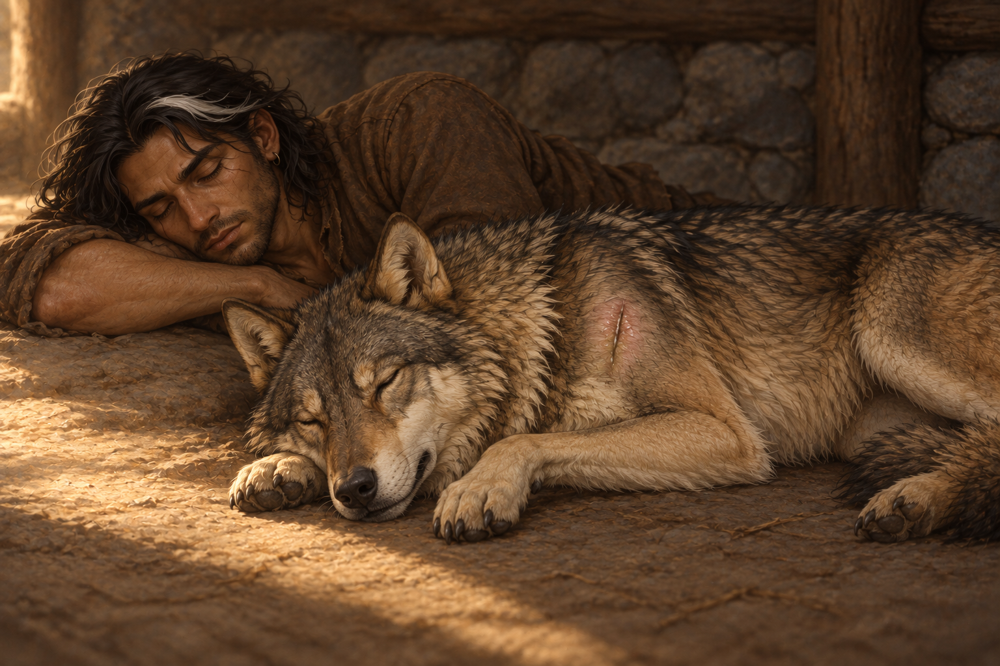

# 🖼️ 有人替我們看護

來源為《刺客正傳Ⅲ・刺客任務》（`book-farseer-trilogy_03`）第六章〈原智和精技〉，[meadow 第一輪心得](../../BookNotes/Library/media/book-farseer-trilogy_03/readers/meadow/chapters/0006/r1_2026-10-02.md)。蜚滋拒絕長期留下學習，但接受在洛夫與荷莉的住所休息。他檢查夜眼左肩劍傷、塗上博瑞屈的藥膏，然後和牠睡在地上；知道有人看護，讓他們得到啟程以來最好的一次睡眠。

被接納並未取消所有分歧。屋主有婚配、學習與交換知識的期待，蜚滋也仍要離開；這份照顧卻可以先被收下。畫面只留下放鬆的手臂、闔眼的面孔與受傷狼的呼吸，把當下可承受的休息放在未解決的未來旁邊。午後暖光沒有把傷口變不見，也沒有替任何人決定該留下。

夜眼已不是昨日捕魚時的健康狀態。左肩的細小傷口保留著，左前腳避免支撐站姿；蜚滋不壓住牠的傷肩，自己的頭靠在手臂上。這次親近的形狀是兩個生命各自能安睡，無需另一個生命不停睜眼。

## 場景規格與引用

- [fitz_recovering_traveler](../NovelIllustrations/farseer-trilogy_03/Characters/fitz_recovering_traveler.md) v1：鬆髮、白髮束、舊鼻傷與右眼下細疤、深褐皮膚、短鬍鬚、小耳環、空衣領、磨舊棕衣。腰部與所有武器在裁切之外；不因未画武器聲稱長劍不存在。
- [nighteyes_left_shoulder_injured](../NovelIllustrations/farseer-trilogy_03/Characters/nighteyes_left_shoulder_injured.md) v1：沿用成年外型，加上左肩未癒合劍傷與左前腳承重受限；休息時右側貼地，左肩朝上，前腿放鬆。
- 一人一狼、低位橫構圖，屋內地面近景。地面、牆角材質、光向與相對睡姿屬插畫詮釋；沒有完整房屋布局，也不建立反覆引用的場景資產。
- 洛夫、荷莉、希爾妲與阿霙均在畫外，不以剪影補外貌。没有床、特殊器物或重要道具；無痊癒宣告、魔法、文字、水印與未讀資訊。

## 生成提示詞

內建 imagegen，兩張本地設定圖均已在開畫前打開，並作為圖片參考。

Create a single finished horizontal literary illustration for Assassin's Quest / Farseer Trilogy volume 3 chapter 6 'The Wit and the Skill'. references: [fitz_recovering_traveler, nighteyes_left_shoulder_injured], use the TWO attached character setting images as exact visual constraints. Narrative moment: after putting Burrich's ointment on Nighteyes' left shoulder injury, Fitz and Nighteyes finally sleep soundly on the floor of their hosts' small log-and-stone hut, knowing someone is watching over them. Exactly ONE young adult man and ONE mature gray-brown wolf, both peacefully asleep, restrained relief rather than magical healing. Composition low intimate medium close view on a dusty plain earthen indoor floor: Fitz lying comfortably on his side behind and slightly left of the wolf, his closed-eyed face and relaxed forearm visible; head resting on his own folded arm, not the wolf's wound. Crop man's body at mid torso, his waist and all weapons completely outside the frame; do NOT show a sword, dagger, belt or props. Fitz: dark brown skin, naturally dark eyes CLOSED, near-shoulder loose dark hair with a small white lock, healed crooked nose and thin healed scar beneath RIGHT eye, short untrimmed beard, small simple metal earring, worn plain brown shirt and collar EMPTY. Wolf lies on its anatomical RIGHT side with the LEFT shoulder facing up toward the viewer, left foreleg bent loosely to avoid weight on it, remaining paws relaxed and naturally arranged, muzzle resting safely on the ground or uninjured paw. Preserve mature robust proportions, cream-yellow ears and neck, coarse black guard hairs through gray-brown coat, natural dark muzzle. LEFT shoulder has the same small shallow healing sword cut with parted fur and a subtle ointment sheen as reference, no flowing blood or exposed tissue, no bandages; it is still injured, not healed. Warm afternoon light comes softly from outside crop and forms a modest patch across earthen floor, cool gray shadows; a little rough log wall and stone texture softly blurred behind, no recognizable furniture. Realistic painterly fantasy book illustration, worn fibers, detailed fur, quiet natural posture, subdued earth colors. Hosts are caring nearby but entirely OUTSIDE FRAME: no human silhouettes, no bear, no eagle. Hut wall texture, light direction and relative resting positions are artistic interpretation, not exact canon plan. No tables or important props, blankets, ornate rugs, beds, recovered brooch, royal emblem, magical glow, ghost, text, watermark, extra humans, extra wolves or later-chapter spoilers. Do not reproduce an embrace or fishing composition; this is shared sleep and real respite with the wound still present.

## 視檢

v1 已打開視檢：恰好一人一狼闔眼休息；蜚滋以手臂作枕，未壓狼肩，鬆髮與白髮束、空衣領與小耳環可辨。夜眼成年毛色、淺黃耳頸與黑色護毛保留，左肩仍有小傷口，無出血、繃帶或魔法痊癒；前腳自然休息，沒有站姿承重要求。人物腰部、武器、屋主和其他動物不在構圖內。圖片沒有文字或水印；後半身被裁切，不能用此圖代替完整解剖設定。

