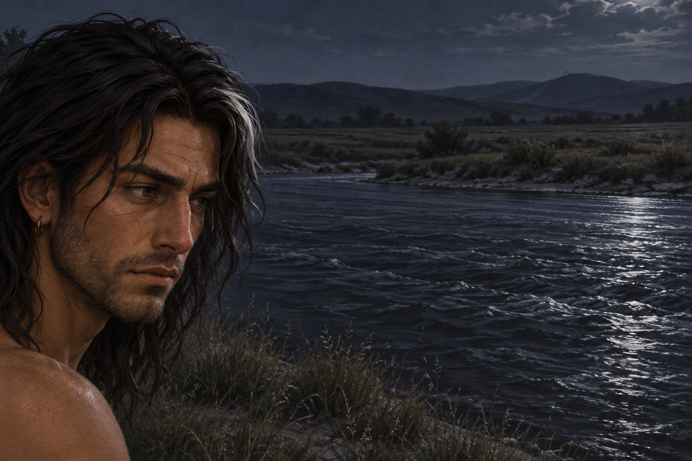

# 🖼️ 沒有喚回你的那一聲

來源為《刺客正傳Ⅲ・刺客任務》第七章〈法洛〉，[meadow 第一輪心得](../../BookNotes/Library/media/book-farseer-trilogy_03/readers/meadow/chapters/0007/r1_2026-10-02.md)。夜眼聽見同類的聲音，堅持獨自去見狼群；蜚滋停止追趕，回到河邊坐下，凝視黑暗流水。這是本章當夜的一個片刻，不合併後來的鷹信、沼澤與精技戰爭夢。

平等在同行時容易說，在朋友要去找自己給不了的生活時才難。我讀到他的恐慌與嫉妒，沒有覺得這些情緒使尊重失效；尊重在於他沒有把召喚發出去。河面佔了大部分畫幅，讓原先總有人並肩的視野突然空出來。他仍失落，也仍有能力不把失落變成對另一個生命的命令。

夜眼說會回來，但目前的章節沒有交代團聚。這張圖因此不畫遠方回頭的狼、狼形倒影或發光牽繫，也不把獨坐畫成永久訣別。蜚滋已收起襯衫，先補本章旅途狀態的頭肩稿；只呈現臉與肩線，未完成的長劍與下半身設定在裁切之外。

## 場景規格與引用

- [fitz_farrow_bare_torso](../NovelIllustrations/farseer-trilogy_03/Characters/fitz_farrow_bare_torso.md) v2：同一成年身份，深褐日曬皮膚、近肩鬆髮與白髮束、變形鼻子、解剖右眼下細疤、短鬍鬚、小耳環；衣領空著。v1 的左右疤痕錯誤已修正，未用於場景。
- 一人、左側頭肩近景、酒河與空岸佔多數橫幅；胸腹、手腳與所有武器在畫外。席地而坐是正文情境，裁切內無法單獨驗證坐姿。
- 河岸植物、河道形狀、遠方地形與月光方向屬詮釋，本次不建立可重複引用的地理場景稿。沒有重要新道具。
- 夜眼與新出現的狼群全部在畫外，不使用尚未建立的狼群角色形象；無團聚宣告、魔法、戰火蒙太奇、文字或未讀資訊。

## 生成提示詞

內建 imagegen，v2 設定已在開畫前打開並作本地圖片參考。完整實際提示詞如下：

Create a finished horizontal literary illustration for Assassin's Quest / Farseer Trilogy volume 3 chapter 7 'Farrow', references: [fitz_farrow_bare_torso] v2, using the attached corrected adult face setting. Narrative moment: after Nighteyes has independently left to meet wild wolves, Fitz sits alone beside the Wine River watching dark flowing water; he struggles not to summon his friend back. ONE ADULT MAN ONLY, absolutely no wolf in the picture. Composition is a quiet environmental HEAD-AND-SHOULDERS CLOSEUP at far LEFT edge, in three-quarter facial view toward the right, cropped at TOPS OF SHOULDERS, chest and rest of body completely OUTSIDE the bottom and left frame. His seated position is narrative context, no visible legs, hands or equipment. Most of the wide image is empty dark river, a low grassy sand bank and distant unoccupied plain under a subtle pale night sky. The close face looks down across the water, sadness and restrained attention, not heroic posing or weeping theatrically. Preserve dark brown sun-darkened skin, natural dark eyes, loose near-shoulder dark hair with small white lock, short beard, healed crooked nose, fine healed scar under anatomical RIGHT eye (viewer LEFT on a frontal face), one modest metal earring. No shirt collar visible, shoulder line only. No jewelry other than earring. Restrained realistic painterly fantasy book illustration; cool charcoal blue-gray water, muted dry grass, quiet natural moonlit edges with very limited highlights, no dramatic moon disk needed. River shape, bank plants and light direction are interpretation, not a recurring location setting. Convey absence through negative space, no spectral wolf, no magical bond ribbon, no wolf-shaped reflection, no flashback or war montage. No sword, dagger, clothing props, bag, scroll, eagle, boat, buildings, other people, text or watermark. Do not imply permanent separation, reconciliation, recovery or later chapter outcomes. Make this a landscape of loneliness with an ordinary adult face, no body emphasis.

## 視檢與上架驗收

v1 已打開視檢：一名成人在左側，目光向河面，白髮束、深色眼、短鬍鬚與解剖右眼下细疤保留；只有一枚可見耳環。肩線近景與大面積空河岸達成，無狼或狼形倒影、無文字水印、無胸針、武器與新角色。身體裁切不能驗證完整坐姿與鞋褲，也不代替完整身形設定。

畫廊索引由 build_gallery.py 重建並以 --check 驗收。瀏覽器本地 file 協定受工具政策限制，頁面互動未驗證；圖片本身使用原生圖片工具視檢。

