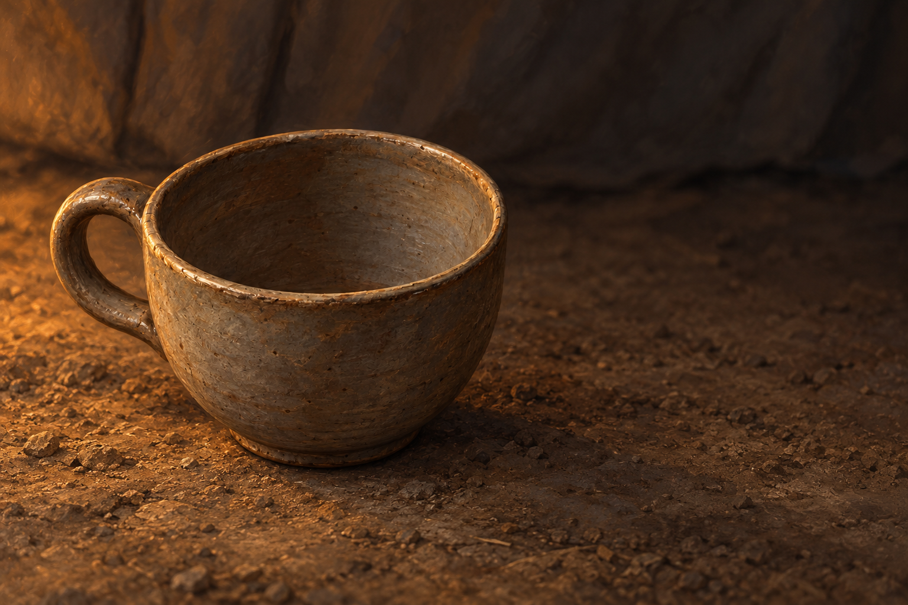

# 🖼️ 把空杯放下

來源為《刺客正傳Ⅲ・刺客任務》（book-farseer-trilogy_03）第三十一章〈精靈樹皮〉，及 meadow 本章 r1 心得。蜚滋拿起茶杯時，曾希望躲進樹皮帶來的遮蔽；等水壺嬸承認無法確定敵人是否毀滅，他最後將空杯放下。這幅圖停在放下之後、出去守夜之前。杯內沒有茶、粉末或蒸氣，不能將拒絕服用的時刻畫成已接受保護。

杯旁的空處留住他仍然害怕的心境。長年當作支援的樹皮被指出可能抑制天分，師傅的善意與知識也可能含誤判；但本章並未量定全部損害與恢復可能。放下空杯並非找到正解或獲得安全，只是暫時保留仍能抵抗的能力，承受一個沒有把握的夜晚。

本章救援弄臣的另一個動作也留在心得裡：穩住而不強行抓取，聽到停止便收手。本圖沒有用光效替那份心智交流定形，也沒有讓空杯成為英雄戰勝恐懼的獎盃。灰褐陶土、粗地與暖光是構圖詮釋；正文未指定杯放在哪個承托面。

## 場景提示詞（內建 imagegen）

Use case illustration-story. New literary fantasy scene, Assassin's Quest chapter 31 Elfbark. references: elfbark_choice_cup, input image is reusable prop reference. Narrative moment at end of chapter: Fitz has just set down his still EMPTY pottery tea cup rather than receiving bark or hot water, before going out to keep watch. Show ONLY the reference's single gray-brown handmade rounded cup with simple loop handle, dry unfilled interior clearly visible, placed on rough packed earth inside a travel tent; no herbs or powder in the cup. Crop extremely close around cup with softly receding unoccupied space. No pouch in frame: Kettle is still holding the bag and remains entirely offscreen. No people, no hands, no wolf, no other utensils, no bedding details or identifiable new set. A soft blurred dark fabric tent wall recedes behind. Dim amber light from an OFFSCREEN brazier grazes the cup's outer edge, interior remains unmistakably empty and readable. Large quiet charcoal-gray negative space suggests uncertainty; no triumphant atmosphere. Restrained painterly oil/gouache fantasy book illustration, textured clay and muted earth, landscape frame. Cup placed on ground is compositional interpretation since text does not specify support surface. Preserve reference cup shape, handle, gray-brown clay. No tea, liquid, steam, glow, supernatural visual effects, symbols, text, watermark, plants or medicine claims. Do not illustrate later outcomes or confirmed recovery.

視檢 v1：單一空陶杯、單把手、杯內乾燥，無藥草或水；背景為暗布與地面，暖光來自畫外。沒有人、狼、藥袋、其他茶具、文字、水印或未來結果；杯形與設定稿一致。

