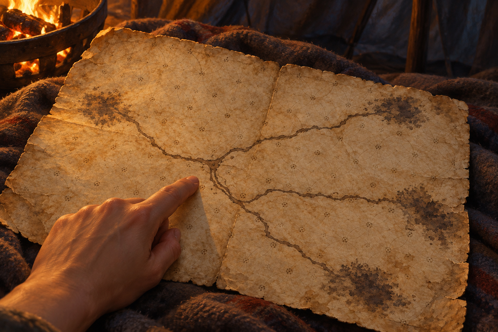

# 🖼️ 沒有答案的古地圖

來源為《刺客正傳Ⅲ・刺客任務》第二十三章〈群山〉，[meadow 第一輪心得](../../BookNotes/Library/media/book-farseer-trilogy_03/readers/meadow/chapters/0023/r1_2026-10-06.md)。夜宿帳篷時，珂翠肯取出惟真留下的古地圖，攤在腿上指出隊伍所在、戰爭遺跡與幾條模糊支路。她問蜚滋要先走哪一條；地圖的線端已褪成暗影，比例與終點都不可靠。

我把畫面停在指尖落向分岔處的一刻。地圖的羊皮紙沒有變，人的世界卻已大幅改變；在看不見終點的路上，珂翠肯仍向蜚滋詢問判斷，而不是把不安包裝成確定。蜚滋也沒有用精技冒險呼喚惟真，因為他擔心精技小組會追蹤他們，也知道自己可能再次沉進那條誘惑他的河流。

羊皮紙、花飾格線與分岔路線依照本章描寫。帳篷毯面、火盆入鏡位置、手部裁切和暖冷光線是構圖詮釋；手不代表可辨識角色。畫面不標出目的地，不畫戰爭遺跡或未確認的山中景物，也不把同行描成已有安全保證。這一章讓我記住，尊重不是代替別人消除風險，而是把風險說清楚，仍承認她可以回答「我了解」。

## 場景規格與引用

- [verity_map](../NovelIllustrations/farseer-trilogy_03/Props/verity_map.md) v1 已先行生成與視檢。沿用褪色羊皮紙、花飾窗格線、分岔墨路與不明確的暗色端點；設定稿沒有可讀文字或地名。
- 場景只呈現羊皮地圖、毯面、火盆暖光和一隻小幅裁切的匿名指路手。人物不露臉、身形、首飾或可辨識服裝；手勢僅指向路徑分岔，不增添新路線或明確目的地。
- 構圖為斜俯視近景，地圖占主要畫面；火光限制在左上側，帳篷其餘部分落入冷暗陰影。情緒克制、思索，表現同行者在不確定中交換判斷。

## 生成提示詞與版本

內建 imagegen；開畫前已打開並視檢 `verity_map_v1.png`，在 prompt 中重述其形狀、紙色、格線與分岔墨路。完整 prompt：

> Use case: illustration-story. Create a finished landscape literary fantasy book illustration for Assassin's Quest / Farseer Trilogy volume 3, chapter 23 'Mountains'. Reference: verity_map_v1, already opened and visually inspected. This is a PROP APPEARANCE reference: preserve its single faded intact parchment sheet, faint flower-like lattice grid, branching sepia ink paths, and indistinct dark smudged endpoints; do not add words, labels, symbols, compass, or definite destinations. Depict one precise quiet moment inside a small wool-lined travel tent at night: the old map is spread across someone's lap, a single cropped anonymous hand gently points to a blank area near one of its branching paths. Keep every person outside the frame except this small hand; no faces, bodies, jewelry, identifying sleeves, or recognizable characters. A softly glowing small brazier just outside the map's edge gives muted amber light; blanket folds and a hint of the tent interior fall into cool shadow. Composition is a close oblique overhead view, with the parchment filling most of the image and the pointing finger modest in scale, leaving the map's branching uncertainty dominant. Mood: thoughtful, restrained, vulnerable trust at the start of a dangerous journey; the paper has not changed although the people's world has. Realistic painterly book illustration, visible oil-and-gouache brushwork, paper grain, muted ochre, charcoal gray, and limited firelight, not photorealistic or glossy. No other props, no wolf, no weapons, no text or lettering, no watermark, no magical glow, no identifiable figures, no events or revelations beyond chapter 23.

## 視檢與驗收

v1 已打開檢查：畫面只有地圖與一隻被裁切的手，羊皮紙、花飾格線與分岔墨路和設定稿一致，未出現可讀文字、標記、地名、人物面貌、狼、武器或水印。毯面與小火盆為本章帳篷夜談的場景詮釋；各路線的終點仍不明。

畫廊索引以 `build_gallery.py` 重建並以 `--check` 驗收。

