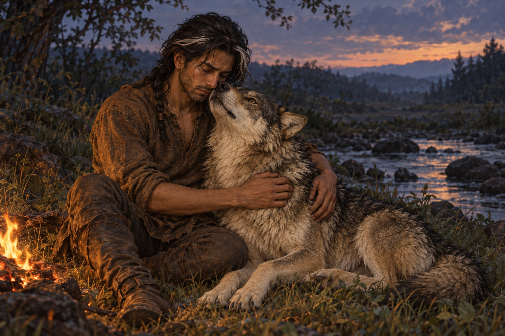

# 🖼️ 不懂遺物，也能抱住你

來源為《刺客正傳Ⅲ・刺客任務》（`book-farseer-trilogy_03`）第四章〈沿河之路〉，閱讀心得：[meadow 第一輪](../../BookNotes/Library/media/book-farseer-trilogy_03/readers/meadow/chapters/0004/r1_2026-10-02.md)。蜚滋在溪岸發現祖父贈予的胸針失落，幾度翻找仍無所得；夜眼感到焦慮，靠上來，將喉嚨向他敞開，痛才稍稍緩下來。

這枚胸針同時牽著王室的所有、不能公開承認的血親與一個已逝的人。夜眼未用同一套記憶理解它，卻先用身體回應了失去。畫面讓衣領空著，讓狼的淺黃喉毛靠近人的臉，兩隻手環住肩膀；擁抱不必先得到完整解釋。蜚滋仍帶著傷痕與疲憊，暖光只照亮當下的一小片草地。

這個親密時刻沒有把旅途畫成安全。第四章還有地牢記憶的回返、河道旁的饑餓與不情願承接的新請求。插圖停在搜索暫止的片刻，不畫胸針已尋回，也不認定它在死人衣上；不借下一章替當下承諾作出結果。

## 場景規格與引用

- 人物：[fitz_recovering_traveler](../NovelIllustrations/farseer-trilogy_03/Characters/fitz_recovering_traveler.md)，v1；深褐皮膚、白髮束、舊鼻傷與右眼下細疤、磨舊棕衣、小耳環、空衣領。場景在入鎮解辮以前，頭髮收作鬆散戰士髮辮。
- 生物：[nighteyes_adult](../NovelIllustrations/farseer-trilogy_03/Characters/nighteyes_adult.md)，v1；成年健康狼、灰褐毛皮、黑色護毛、淡奶黃耳頸、自然深色眼鼻與粗壯腿部。
- 中近景橫構圖，一人一狼、溪岸與微小營火。暮色、火位、溪流形態是插畫詮釋；不建立新的地圖或可重複場景設定。
- 本圖的敘事主體是人物的接觸，營火、草地與水面只作環境，不增加關鍵道具。禁畫胸針、王室符號、魔法、人狼融合、文字、水印或後續情節。

## 生成提示詞

內建 imagegen，使用上述兩張本地設定圖作參考，開畫前均以 view_image 打開。Single literary illustration, Assassin's Quest chapter 4, The River Road. After discovering his grandfather's brooch missing, Fitz stops searching beside a creek, Nighteyes exposes his throat in trust while Fitz embraces him. References: [fitz_recovering_traveler, nighteyes_adult]. Exactly one young adult man and one mature gray-brown wolf; retain black guard hairs, pale cream-yellow ears and throat, dark natural eyes and muzzle, powerful legs. Fitz: dark brown skin and eyes, crooked healed nose, subtle scar below RIGHT eye, dark near-shoulder hair with white lock gathered into a loose warrior braid, slight beard, worn plain brown clothes, small earring, empty collar. Medium-wide horizontal composition; seated man with both arms around wolf shoulders, wolf head tilted upward with throat gently against his cheek/chin. Relaxed ears, no bared teeth. Weary tenderness and lingering grief, no triumphant smile. Quiet grassy creek bank at dusk, very small low amber campfire against blue-gray shadows. Soft painterly background, realistic fantasy book illustration, natural cloth and detailed fur. No other people, extra wolves, recovered brooch, ruby, combat, dead body, royal symbols, magic glow, human-wolf fusion, text, watermark or later spoilers. Fire size and creek layout are interpretation.

v1 已打開視檢：一人一狼、空衣領、白髮束與鬆辮、自然眼鼻、成熟狼體與黑色護毛可辨；雙手環抱，夜眼仰頭露出淡色喉部、耳朵放鬆，沒有露齒或魔法。背景無旁人，無文字與水印。狼後足部分藏於身體下與草叢，屬休息姿勢；未據裁切聲稱完整四足設定。

