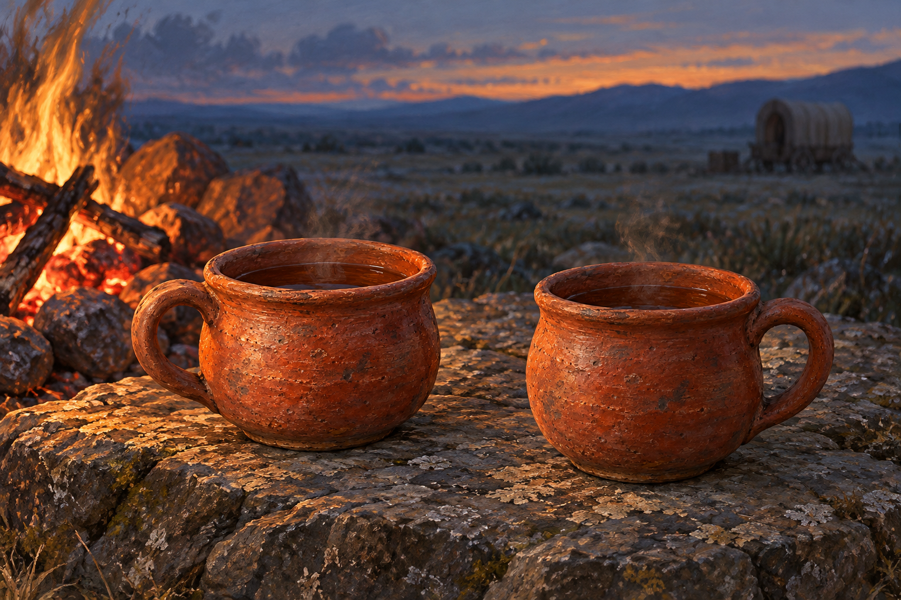

# 🖼️ 茶仍溫著，路仍未開

來源為《刺客正傳Ⅲ・刺客任務》第十一章〈牧羊人〉，[meadow 第一輪心得](../../BookNotes/Library/media/book-farseer-trilogy_03/readers/meadow/chapters/0011/r1_2026-10-03.md)。塔絲煮好一頓晚餐，泡了一壺茶，兩人在營火旁用厚實紅陶杯喝茶。蜚滋暫時不再只想著自己的困境，也讓塔絲的瑣事有了能被聽見的位置。

我願意保存這份具體的照料，卻不能把暖光當成自由。塔絲仍被買賣與鞭打束縛；蜚滋替她處理傷口，對她生活的解釋卻仍拿衣食充足替權力辯護。另一條路上，他知道莫莉與女兒在哪個方向，身體卻無法忽略惟真留下的命令。想往哪裡走，和被允許走，有時隔著沒有看守者的門。

兩只杯不替兩人預約未來，也不把章末的疏離提前畫進晚餐。這個暫停真的存在，即使它不能把人的全部需要都裝滿。人物不入畫，讓小小的暖意與遠處仍未看清的路同時留在畫面裡。

## 場景規格與引用

- [camp_red_tea_cup](../NovelIllustrations/farseer-trilogy_03/Props/camp_red_tea_cup.md) v1：兩只同款厚口、圓腹、樸素把手的紅褐陶杯，裝有茶；杯形與把手為視覺詮釋。
- 晚餐後、章末衝突以前的營火旁靜物近景。兩只杯暫放於火邊平坦石面，杯與杯之間留窄小距離；安放姿態並非正文指定動作。
- 遠方草原、模糊貨車輪廓與暮色，皆為場景詮釋。車輛不作具體戲班車或岱蒙貨車設定，不能據此辨認車主。
- 蜚滋、塔絲、手、動物、傷口、刀、鞭子與斗篷都在畫外；不用人物剪影代替尚未建立的本章人設。沒有符文、精技光線、人物出現在莫莉小屋或之後劇情。

## 生成提示詞

使用內建 imagegen。已開啟設定稿作道具外型參考；實際 prompt：

Use case: illustration-story. Finished horizontal literary illustration for Assassin's Quest / Farseer Trilogy volume 3 chapter 11 The Shepherd. Reference image is PROP IDENTITY reference, not an edit target. References: [camp_red_tea_cup] v1. Keep the squat rounded brick-red earthenware body, thick rolled rim, sturdy single loop handle, aged matte terracotta firing marks and unadorned design. Depict exactly TWO matching cups filled with dark amber tea, resting separately with a small gap on a low rough flat stone beside a modest evening campfire. This is an unpeopled crop interpreting the pause after Tass and Fitz share dinner and drink tea, BEFORE the later disagreement. Their temporary warmth does not solve either person's lack of freedom. Cup placement, stone and lighting are interpretive, not claimed textual facts. Intimate cups in the foreground; small ember-red fire at one side, open cool gray-blue dusk plain beyond, a distant generic covered wagon reduced to an indistinct out-of-focus shape with no readable decorations. Visible gouache and oil brushwork, tactile earthy surfaces, realistic historical fantasy book illustration, quiet tender but unresolved mood, restrained warm reflections on the cups against cool spacious shadows. Tea stays mundane, at most faint natural steam. No people, hands, human silhouettes, animals, clothing, weapons, whips, injuries, faces, birth scene or later outcomes. No jewelry, extra cups, plates, ornate tea service, typography, inscription, labels, watermark, border or magical glowing threads. Preserve clay design from reference, not modern glossy mugs or porcelain. Landscape composition with breathing room and natural firelight.

## 視檢

v1 已打開視檢：恰好兩只厚口紅陶杯，圓腹與樸素把手沿用設定，茶面與細薄熱氣可見。石面、火光、暮色與模糊的通用貨車輪廓為詮釋；沒有人物、手、動物、傷口、文字、水印或魔法。茶杯各自獨立，未將另一時點的斗篷或衝突補入構圖。

