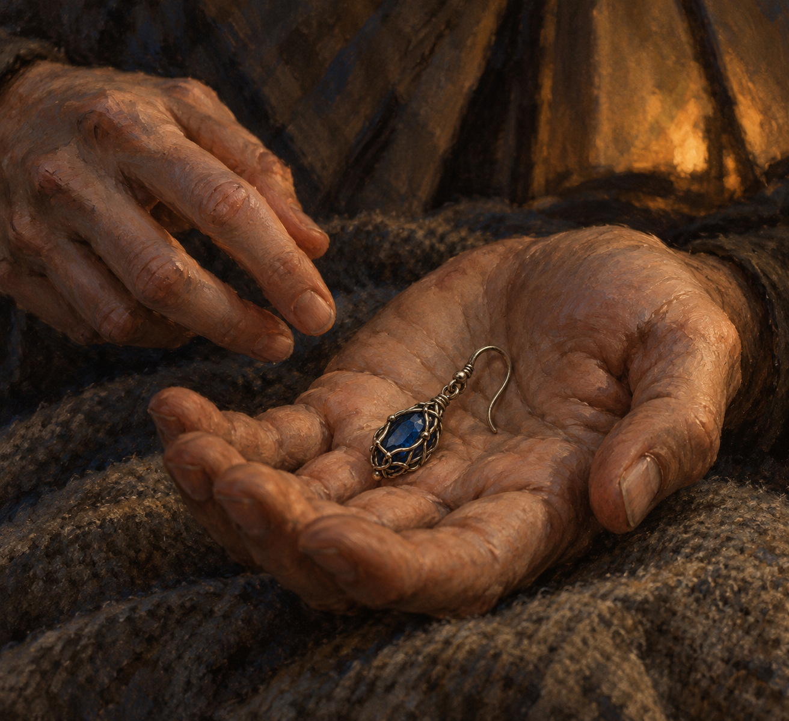

# 🖼️ 在明天之前說出口

來源為《刺客正傳Ⅲ・刺客任務》第三十二章〈胡瓜魚海灘〉，[meadow 第一輪心得](../../BookNotes/Library/media/book-farseer-trilogy_03/readers/meadow/chapters/0032/r1_2026-10-08.md)。蜚滋以為自己的日子已經可以數盡，回到帳篷將耳環交給弄臣，請他日後帶回博瑞屈，說明自己履行了對國王的誓言，也說出對養育者的感謝。

我把畫面停在信物落進掌心之際。蜚滋害怕的死亡尚未得到證實，但感謝不必等到預言揭曉才說出口。耳環的重量極小，卻讓一句拖延多年的話可以被另一個人接住。

交託仍不是事情已辦妥：弄臣尚未送回耳環，莫莉並未獲知蜚滋活著，兩人也未獲保證能生還。本圖不把真摯畫成所有決定都正確，只讓今晚的承諾先有一個位置。

## 場景規格與引用

- 引用已視檢的 [freedman_sapphire_earring](../NovelIllustrations/farseer-trilogy_03/Props/freedman_sapphire_earring.md) v1：單一小型橢圓深藍寶石、細舊銀絲網、小連接環與可穿耳小鉤，非黃金、非胸針、不發光。
- 只露一隻捧著信物的鬆弛手掌與另一隻剛放下信物的手指；不畫臉、耳、可辨衣裝或其他角色。此為工作流的刻意留白例外，局部手部不作人物外貌設定，不能用第二十章弄臣外貌代替當章狀態。
- 帳篷內毛毯、冷灰陰影與畫外弱暖光為構圖詮釋。這是夜晚託付耳環，不合成池邊昏睡、夢魘、野外烤肉或章末搔耳；無銀色魔法線。

## 生成提示詞與版本

內建 imagegen，使用先打開視檢的道具設定稿作唯一圖像參考。完整實際 prompt：

Create a hand-painted realistic literary fantasy book illustration for Assassin's Quest, Farseer Trilogy volume 3, chapter 32 'Herring Beach'. Narrative moment: inside a dim tent at night, Fitz has just placed Burrich's inherited earring into his exhausted friend's loose open palm, entrusting a message of gratitude before an uncertain tomorrow. References: freedman_sapphire_earring. Use the attached image ONLY as the identity reference of the SINGLE tiny earring: one small oval deep-blue sapphire enclosed by an intricate open net of fine aged SILVER wire, a small connecting ring and slender functional ear hook. Preserve these features; it is silver with muted warm reflections, never gold, not a brooch, no extra jewels, no glow. Intimate close crop at hand level: one relaxed adult hand palm-up resting over a rough gray-brown blanket, one other adult hand with fingertips gently withdrawing after placing the earring, the small earring lying naturally in the palm, believable wearable scale. Exactly two hands, anatomically natural, no visible faces, heads, ears, torsos or identifiable costume; do not define the current appearance of either character. Painterly oil and gouache, visible brushwork, broken soft edges and paper grain, muted earthy browns, cool gray shadows and a small restrained offscreen warm light. Shallow dim background suggests only tent fabric, no elaborate props. Emotion: gratitude spoken now, tender but unresolved, neither funeral nor guaranteed safety. Do not depict death, prophecy, ghost, beach, family reunion, delivering the earring to Burrich, wolf, magical threads, jewelry duplicates or extra people. No text, lettering, captions, borders or watermark. Clearly painted illustration, not a photograph or glossy jewelry advertisement.

## 視檢與驗收

v1 已打開視檢：兩隻局部成人手，單一小型藍寶石銀絲耳環與小鉤，捧掌與撤開指尖可辨，無面容、文字、水印或魔法光線。銀絲在暖光下略呈暖灰，仍與設定相容；沒有新增金色部件。筆觸與粗毛毯質感清楚，信物比例可穿戴，未將託付畫成死亡或送達。手部紋理為匿名局部的視覺詮釋，不作弄臣年齡或膚色設定。

畫廊索引以 build_gallery.py 重建並以 --check 驗收。瀏覽器受 file:// 存取限制，未完成互動畫廊驗證；不以索引通過冒充瀏覽器驗證。

