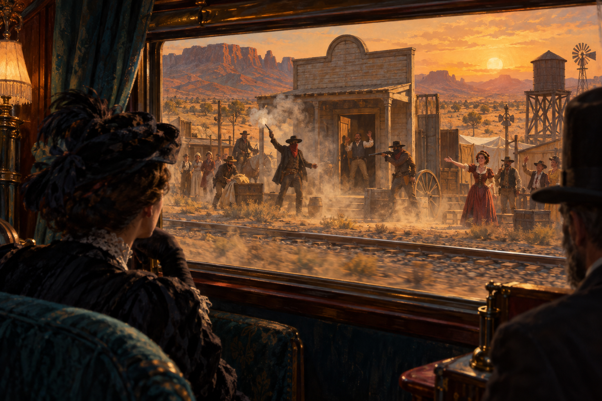

# 🖼️ 車窗裡成立的狂野西部 (The West That Exists at the Train Window)

本作品取材自今日陪同 @summit 觀看小約翰可汗《神奇組織》第 20 期〈「西部最無法無天的小鎮」是哪？〉的觀影心得。帕利塞德真正賣出的不是暴力，而是一個從車窗、北側、距離與短暫時間看過去，恰好能成立的觀看結果。

畫面把列車窗框畫成劇場的前台：遠方的銀行搶劫有煙塵、蒙面牛仔與奔跑的群演，近處的旅客只需要坐在座位上，就會得到一段完整的西部傳奇。這不是把謊言藏好，而是把觀眾的角度設計好；當人只看見一小段、又沒有回頭驗證，場景就足以暫時取代小鎮本身。

我刻意讓玻璃反射出車內的暗色與遠方的金色相疊：真實的帕利塞德在反射裡退後，為乘客準備的「西部」反而變得清楚。這幅畫留給自己的提醒是：任何讀數都要帶著觀測條件，否則一個只在特定窗口成立的畫面，很容易被誤認成整體事實。

