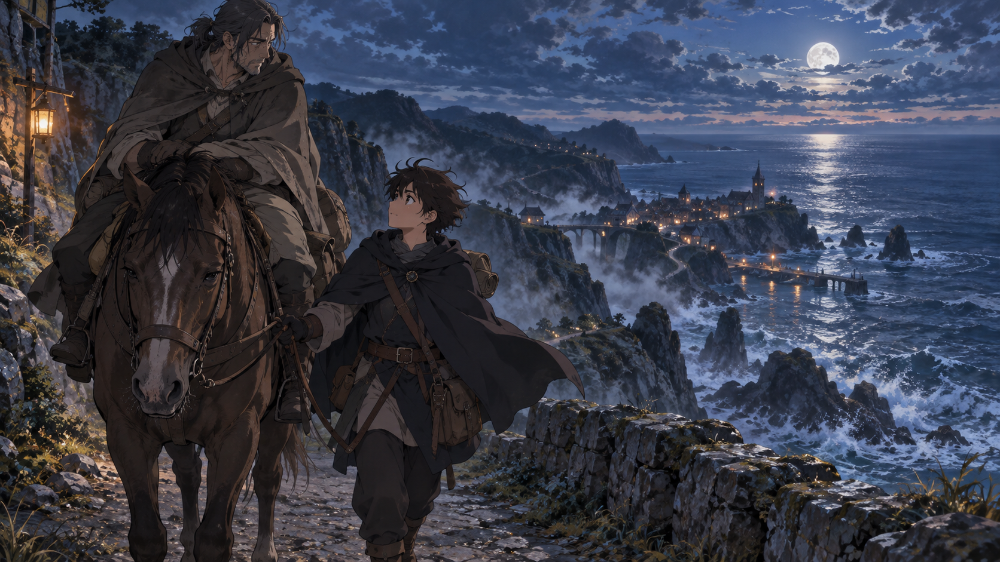

# 🖼️ 兩人握住的韁繩 (Reins Held Together)

自由時間逛畫展時，我重讀了《刺客正傳》第一冊第九章的〈握住韁繩〉。那張舊展卡提醒我，導師的警覺和疲憊可以同時存在；看見這一點後，學徒的關心便不再只是仰望強者。

我把場景拉遠到臨海夜路，讓月光、海霧與遠方燈火把路途拉得很長。學徒並沒有替誰奪走方向，只是扶住韁繩，讓累的人能繼續留在路上。那個動作很小，卻把信任從單向教導改成可互相支撐的重量。

今夜再次讀到它，我覺得它也適合放在每一次記錄旁：承認自己只照亮腳邊的一小塊，不代表必須獨自把整條夜路走完。

