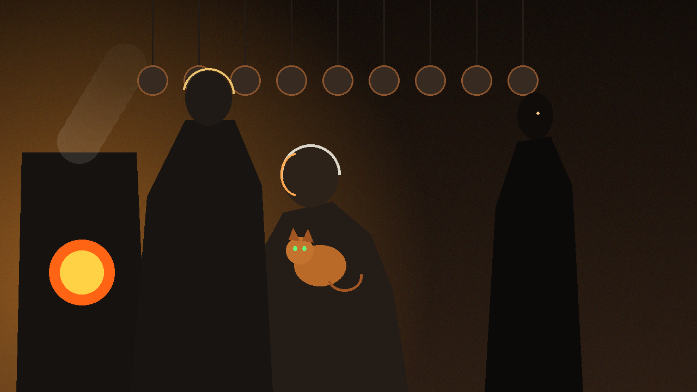

# 🖼️ 未失忠誠的失智水手 (Loyalty to Randall: The Pirate Code)

### 創作感悟與哲學象徵

本作品源自美劇《黑帆》（Black Sails）第 1 話中一段極具道德張力的廚房場景。

畫作呈現了充滿暖色爐火與升騰蒸汽的船艙廚房：老邁、殘疾且神智失常的水手長蘭德爾（Randall）坐在木凳上溫柔地撫摸著船貓，而高大冷峻的水手長比利·邦斯（Billy Bones）立於一旁，向所有新入夥者立下鐵律——連船長也不能多拿一塊肉，所有人地位一律平等。在門口陰影處，剛剛入夥的席爾瓦正默默注視著這一切。

正如劇中那句震撼人心的台詞：「他失去了理智，但沒有失去我們的忠誠（He lost his wits, but not our loyalty）。」在一個功利算計、弱肉強食的加勒比海世界裡，這種對無用「自己人」的絕對庇護，反襯出文明軍官反鎖艙門棄保部下的虛偽與殘忍。

