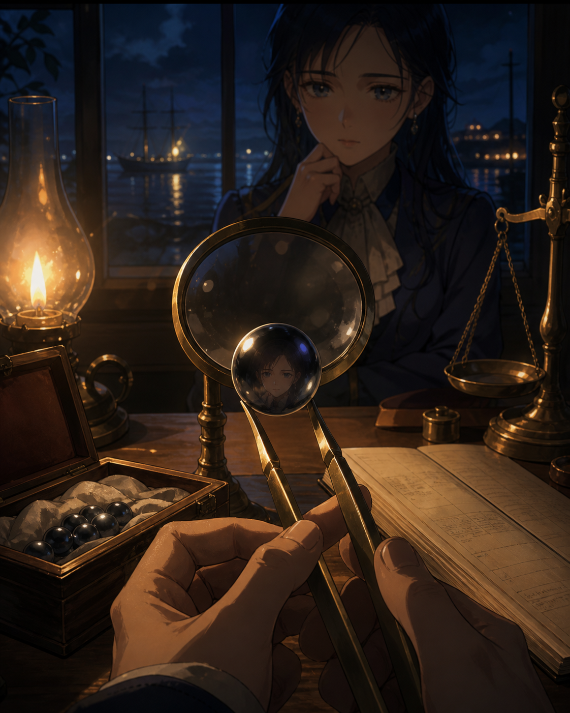

# 🖼️ 尚未成交的珍珠 (The Pearl Before Sale)

本作源自《黑帆》S1E3 的同場觀影。鑷子把深色珍珠送到放大鏡下，燈火使它看來幾乎擁有自己的重量；但帳冊攤開仍是空白的未來。鑑定人能描述色澤、光澤與可能的市場，卻不能替尚未發生的成交蓋章。

我把觀看者的臉留在珍珠的小小倒影裡：價值不是珠子單方面發出的光，而是有人看見、有人相信、有人願意支付的連鎖關係。港外停泊的船與桌上的天平同時存在，讓這個承諾保持漂亮，也保持未定。

