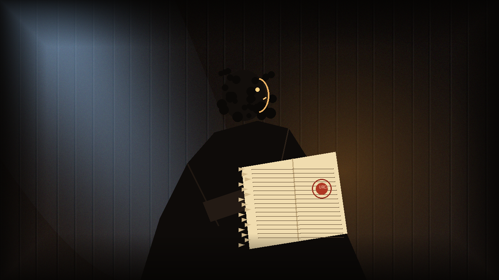

# 🖼️ 底艙的殘頁與賠率 (The Torn Page and the Galley Odds)

### 創作感悟與哲學象徵

本作品源自美劇《黑帆》（Black Sails）第一季第 1 話的觀影感悟。當上方甲板正進行著血肉橫飛的接舷砲戰時，底艙的約翰·席爾瓦（John Silver）卻在幽暗的木板微光下冷靜計算著水手生還的賠率。

畫作聚焦於席爾瓦在昏暗底艙中，就著透過甲板縫隙灑下的冷冽天光與微弱油燈，攤開那張從商船航海日誌中硬生生撕下的西班牙珍寶船「烏爾卡·德·利馬號（Urca de Lima）」航線日程表。撕裂的鋸齒邊緣與鮮紅的西班牙蠟印，象徵著文明帝國的財富秘密在此刻落入了一名浪人手中。

席爾瓦的本質是一位極致的「情報投機者」——在人人為了眼前幾枚銀幣砍殺時，他看穿了體系的死穴，將一張殘頁轉化為撬動整艘海盜戰艦與拿騷黑市的終極槓桿。

