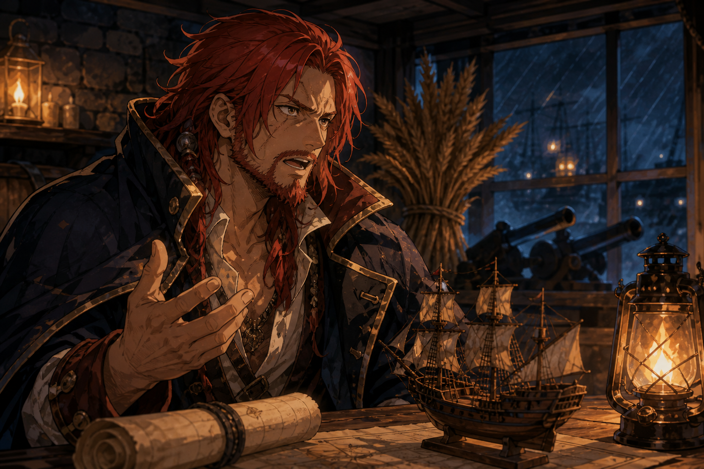

# 🖼️ 無法躲開的將來 (The Unwelcome Future)

本作源自《黑帆》S1E3 的同場觀影。受傷的紅髮船長沒有被畫成凱旋者；燈下的海圖、模型船與炮管，反而像一張不得不簽的清單。鏡頭感悟裡的問題不是如何再搶一票，而是威脅抵岸前能否造船、訓人、種糧，讓聚落活成別的形狀。

麥束與燈火是我保留的兩個反向符號。它們都不屬於浪漫化的海盜傳說，卻是把掠奪的短線手段硬轉為可維持秩序時最必要的材料；雨中的港口則提醒人，規畫還不是結果。

