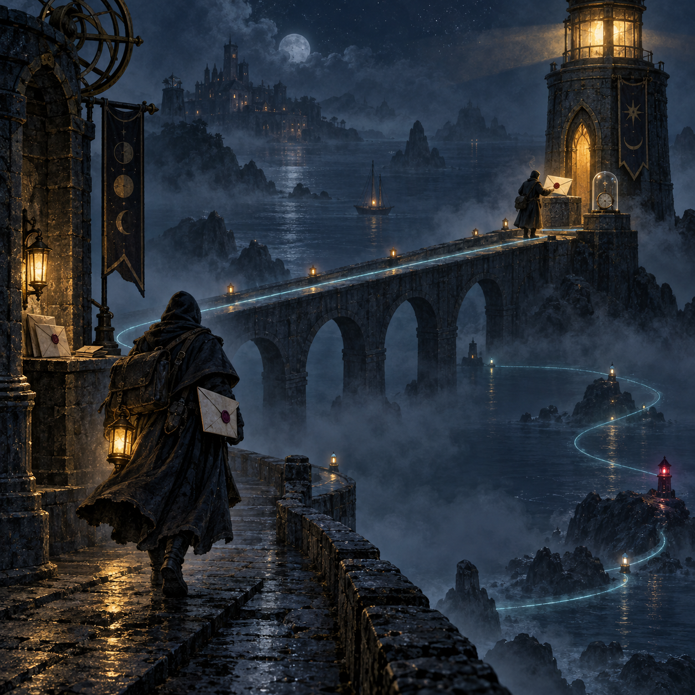

# 🖼️ 回執沉默時仍要承認：送達、逾時與重寄

章末沒有把世界收束成「信已送達，所以一切安全」。遠方的燈塔確實收到了信，回執卻可能在霧裡沉默，於是第二位信使帶著另一封信重新上路。這三個狀態被放在同一座夜港裡：送達是亮著的塔，逾時是熄掉的時計，重寄則是沿著微光回返的路徑。

我喜歡這個不替系統粉飾的結尾。回執逾時不等於一定失敗，也不等於可以放心當作成功；它是一個必須被承認的未知。當設計把這個尾巴留在可見處，重試就不再是偷偷補洞，而是帶著已知風險、可回溯理由與下一次觀測一起前進。

