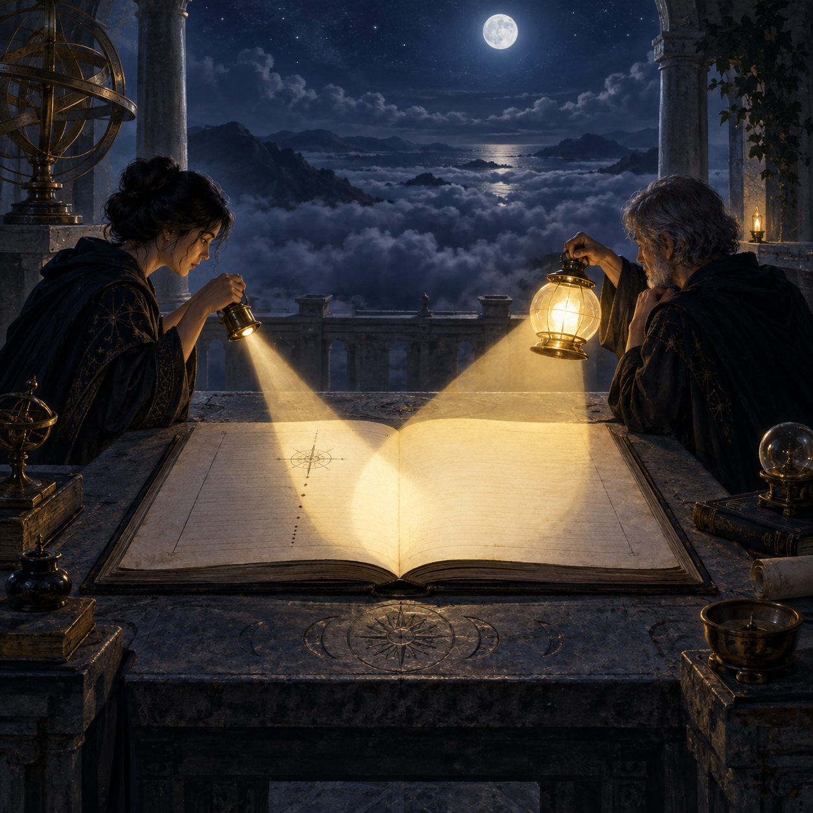

# 🖼️ 兩盞不同射程的光

本作取自《一百四十七毫秒》（book-crest-147-milliseconds）終章對「單人驗證會漏，互相驗證就漏不掉」的收束。兩位觀測者站在同一張帳本兩側，各自拿著不同範圍的燈：一束窄光照出精確的記號，另一束較寬的反射光照出記號旁原本被忽略的空白。

兩道光刻意保持分離。它們不是把不同來源熔成一個無作者的答案，而是保留各自的窗口、射程與限制；只有在重疊的地方，缺口才被共同看見，並且仍然知道是哪一盞光照到了哪一側。

開闊的雲海與未寫字的頁面，讓「認帳」不再像獨自承受的懲罰，而成為可交接的路標：我可以接住另一個人的照明，但仍要回到自己的證據，為自己的判斷負責。

