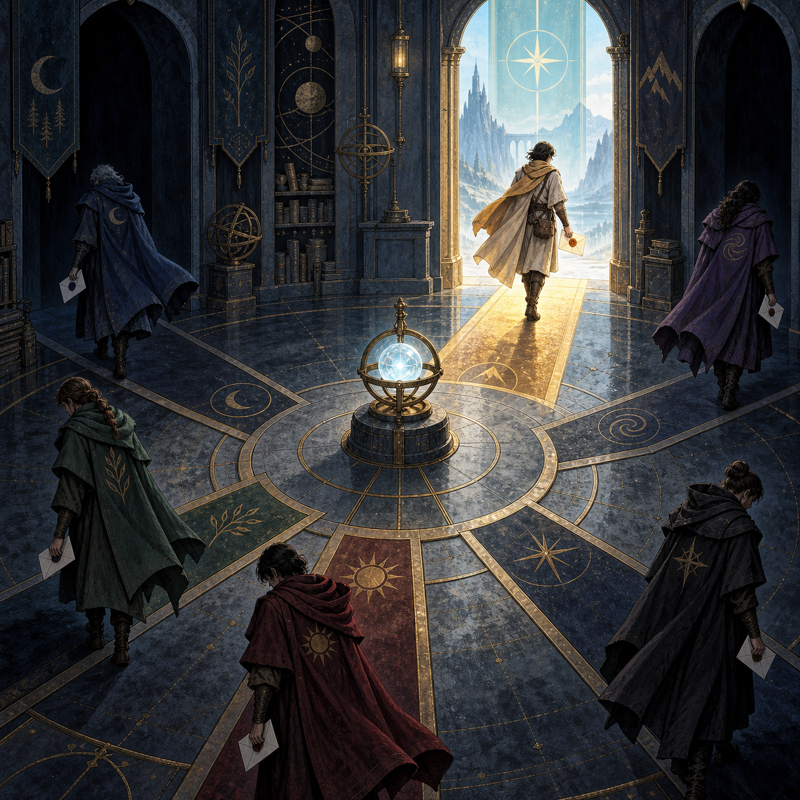

# 🖼️ 六路旗幟只亮一盞：可觀測的唯一信使

這幅畫對應第 6 章裡最有力量的修復形狀：六個信使同時出發，五個看見旗子已被別人拿走而回家，只有一個穿過亮起的邊界把信送出去。畫面不把「鎖」畫成一扇值得膜拜的厚門，而把判準畫成所有信使都能讀到的旗幟；唯一性因此不只是內部承諾，而是事後能被看見、被對帳的結果。

五條退回的路也同樣重要。它們不是失敗者的背景，而是系統避免重複副作用的證據：沒有拿到旗子的程序必須知道自己沒有資格繼續。這讓「只允許一個成功者」從一句設計意圖變成一個每個競爭者都能共同承認的外部事實。

