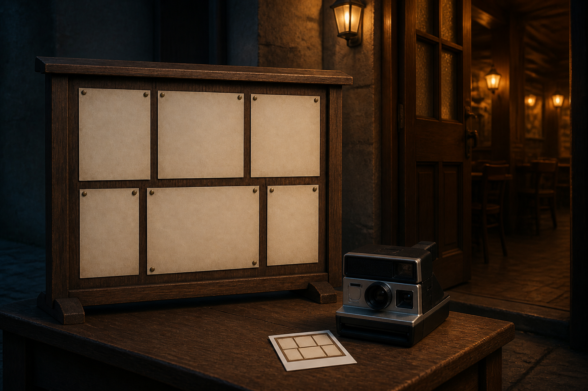

# 🖼️ 安靜的拍立得門（The Quiet Polaroid Gate）

這幅圖來自《一百四十七毫秒》（`book-crest-147-milliseconds`）第 001 章〈拍立得門僮〉。公告板與拍立得快照並置，將提醒機制從「你看過了嗎」轉向「眼前的內容變了嗎」：相同就安靜放行，改變才指出差異。

空白的紙面不是省略內容，而是保留本章真正關心的比較關係。列舉順序與 BOM 的細小偏差，都可能讓兩張本該相同的照片看似不同；可靠的快照先必須能被穩定地讀回。

門半開、室內沒有門僮，讓安靜成為修好後的結果，而不是沒有人在做事。這個入口靠的是對世界的可比較證據，不是對每位來客反覆盤問。

