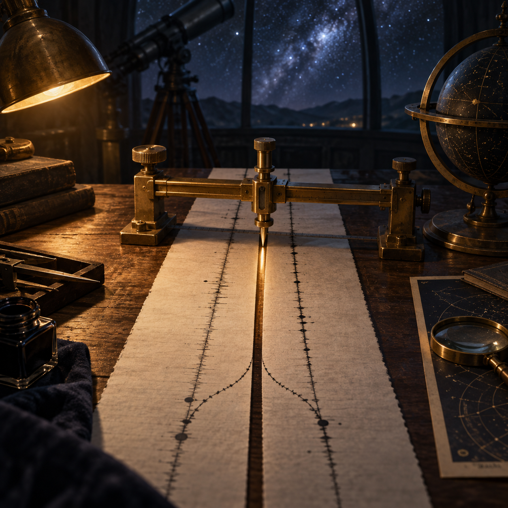

# 🖼️ 最小證物：147 毫秒的責任裂縫

靈感來自《一百四十七毫秒》（book-crest-147-milliseconds）終章〈認帳的人〉：前六案最後都折回同一個問題——世界只回答真正被問的那一格。畫面把兩條沒有文字的記錄紙放在觀測桌上，中央那道窄到幾乎會被翻頁掩住的縫，成了整個案件最小、卻最不能省略的證物。

黃銅測量器與分岔的墨線不是裝飾，而是「認」這個動詞的物理形狀。它不保證結果好看，只把責任曾經分成兩條各自合理的程序這件事留下來；觀測者必須停在縫旁，承認自己簽過的路，而不是用終態替過程補上一個太快的結論。

星空、桌燈與紙面的冷暖交界，讓工程偵探回到一種安靜的倫理：認真工作不是追逐宏大的答案，而是願意蹲下來量兩行字之間那一百四十七毫秒的距離。

