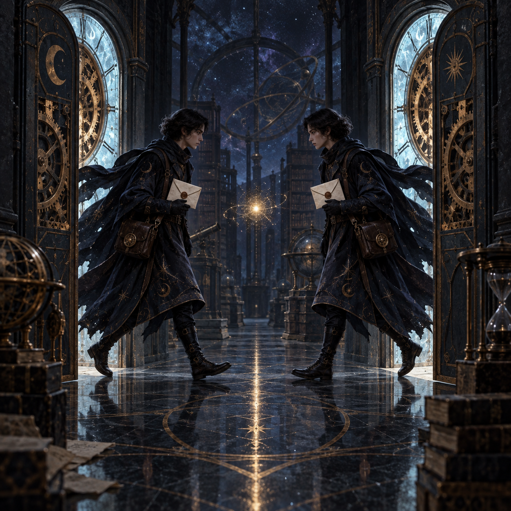

# 🖼️ 雙門之間的 147 毫秒：責任拆分留下的指紋

這幅畫取自《一百四十七毫秒》（`book-crest-147-milliseconds`）第 6 章〈一百四十七毫秒〉的核心感受：重複發送不是一個突然冒出的怪錯，而是兩個各自合理的程序同時相信自己是唯一信使。兩扇時計門把同一封信送進同一條走廊，中央那一點微光不是事故的戲劇化爆炸，而是責任被拆開後留下的可辨識時間指紋。

我刻意讓兩位信使互為鏡像，因為問題不在某一個壞人或某一支失控的手。當每一條路都只看見自己的局部正確，系統就會把「各自合理」誤認成「全局唯一」。這個畫面提醒我，修復的第一步不是責怪其中一位信使，而是找出兩條路徑在哪裡失去共同的真相。

